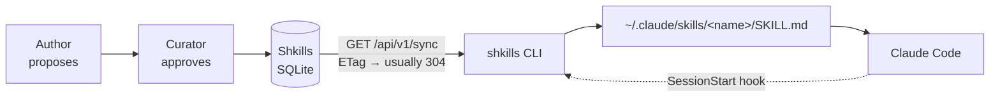

<div align="center">

# Shkills

### Every skill your company knows. On every machine.

**Write a Claude skill once. Have it reviewed. Everyone's Claude picks it up at
the start of their next session — no copying files, no stale versions, nothing to
remember.**

[](LICENSE)
[](https://nodejs.org)
[](https://www.typescriptlang.org/)
[](docs/development.md#tests)
[](docs/deployment.md)
[](docs/)

[**Documentation**](docs/) · [Quick start](#quick-start) · [How it works](#how-it-works) ·
[Deploy it](docs/deployment.md) · [API](docs/api.md)

<br>


</div>

<br>

---

## The problem

Someone on your team writes a genuinely good Claude skill. A code review
checklist that catches the things your reviews actually miss. A commit format
everybody argued about for a month and finally settled.

Then what?

They paste it in Slack. Four people copy it into `~/.claude/skills`. Two of them
typo the description so it never fires. A month later the author improves it —
and now there are five versions in the company, nobody knows which one they are
running, and the three people who joined since have none of it.

**Skills copied by hand go stale the moment they are copied.**

## The fix

Shkills makes your skill set something you **subscribe to** rather than something
you **copy**.

<div align="center">


<sub>The entire onboarding. There is no second step.</sub>

</div>

<br>

After that command, a `SessionStart` hook refreshes the skill set before every
Claude session. Publish a change in the portal and it is on every subscribed
machine by the start of their next session.

<div align="center">

| | Copy-paste | Shkills |
| --- | --- | --- |
| **Getting a new skill** | Find the Slack message, hope it is the latest | It is already there |
| **Improving one** | Tell everyone. Twice. | Publish it |
| **Knowing what is running** | Nobody knows | `shkills list` |
| **Onboarding someone** | "Ask Rob for the skills folder" | One command |
| **Undoing a bad change** | Message everyone again | Roll back; every machine follows |
| **Quality control** | Whoever pasted it | Review before it reaches anyone |

</div>

---

## Quick start

```bash
git clone https://github.com/ydbondt/shkills.git
cd shkills

npm install
npm run seed          # sample company: 5 people, 9 skills, 4 collections
npm run build
npm start             # → http://localhost:4000
```

Sign in with any seeded account — password `shkills123`:

| Account | Role | Can |
| ------- | ---- | --- |
| `maya@acme.test` | admin | Everything, plus managing people |
| `rob@acme.test` | curator | Approve, publish, manage collections |
| `dan@acme.test` | member | Propose skills, subscribe |

Then onboard a machine:

```bash
curl -fsSL http://localhost:4000/install.sh | sh
```

→ [Full getting-started guide](docs/getting-started.md)

---

## How it works

Claude Code reads personal skills from `~/.claude/skills/<name>/SKILL.md`. So:

1. `shkills login` links a machine and registers a **`SessionStart` hook** in
   `~/.claude/settings.json`.
2. Claude runs that hook before every session. It calls `shkills sync`, which
   asks the server for the current skill set and writes the files.
3. That is it. There is no daemon, no polling loop, and no second setup step.



A sync sends `If-None-Match`, so the common case is a **`304` with no payload** —
cheap enough to run at every session start without anyone noticing.

→ [The architecture and the sync protocol, in detail](docs/how-it-works.md)

---

## What you get

<table>
<tr>
<td width="50%" valign="top">

### 📚 A catalog people actually browse

Search, filter by category and audience, see what you already have. Every skill
shows its trigger description — the sentence that decides whether Claude reaches
for it at all.

</td>
<td width="50%" valign="top">

### ✅ Review before it reaches anyone

Members propose, curators approve. A review in flight **never takes the live
skill away from anyone** — v3 keeps serving while v4 waits.

</td>
</tr>
<tr>
<td valign="top">

### 📦 Collections, not checklists

"Backend Engineering" or "Sales" — a whole role's worth of skills in one
decision, including whatever gets added later. Mark one **company default** and
it applies to everybody, with no opt-out.

</td>
<td valign="top">

### 🕰️ Real version history

Every change is a version, with an author, a reviewer, a change note and a
checksum. Roll back and every machine follows on the next sync.

</td>
</tr>
<tr>
<td valign="top">

### 🔒 Your own skills are never touched

Shkills only writes directories it created, each marked with a `.shkills.json`
file. A collision with something you wrote by hand is **skipped with a warning**,
never overwritten.

</td>
<td valign="top">

### 🚀 One command to onboard

`curl … | sh` checks Node, installs the CLI, remembers the server, and hands over
to login. Idempotent — put it in your laptop setup script.

</td>
</tr>
<tr>
<td valign="top">

### 📊 Adoption you can see

Who has linked a machine, who synced today, what is waiting on review. Find the
colleague who installed it in March and never opened Claude again.

</td>
<td valign="top">

### 🐳 Boring to run

One container, one SQLite file, one URL. No queue, no cache, no second service.
`docker compose up -d`.

</td>
</tr>
</table>

---

## A look around

<div align="center">

<b>Review — approving one puts it on every subscribed machine</b><br>


<br><br>

<b>Skill detail — including the exact bytes Claude will read</b><br>


<br><br>

<b>The editor — the trigger description gets the space it deserves</b><br>


<br><br>

<b>Collections — a whole role's worth of skills in one decision</b><br>


<br><br>

<b>People — adoption at a glance</b><br>


<br><br>

<b>Your setup — the page you send to a new colleague</b><br>


<br><br>

<b>And it all works on a phone</b><br>

&nbsp;&nbsp;&nbsp;


</div>

---

## The CLI

<div align="center">

<br>
<sub><code>shkills list</code> — what is installed here, and <i>why</i></sub>
</div>

<br>

| Command | What it does |
| ------- | ------------ |
| `shkills login` | Link this machine (also runs `setup`) |
| `shkills setup` | Turn on automatic updates — `--off` to turn them off |
| `shkills list` | What is installed here, and which collection sent it |
| `shkills browse [q]` | Search the company catalog |
| `shkills collections` | Ready-made sets of skills |
| `shkills add <name>` | Install one skill · `remove` to drop it |
| `shkills use <name>` | Join a collection · `unuse` to leave |
| `shkills sync` | Pull now — `--dry-run` to preview, `--force` to bypass the cache |
| `shkills status` | Server, account, hook state, last sync |
| `shkills show <name>` | Print a skill exactly as Claude sees it |
| `shkills clean` | Remove every skill Shkills installed |
| `shkills logout` | Unlink this machine |

The whole CLI is **one file with no runtime dependencies**. The server hands it
out at `/cli/shkills.mjs`.

→ [Full CLI reference](docs/cli.md)

---

## Deployment

Single container, single SQLite file:

```bash
cp .env.example .env      # set SHKILLS_PUBLIC_URL and SHKILLS_JWT_SECRET
docker compose up -d
```

| Variable | Default | Notes |
| -------- | ------- | ----- |
| `PORT` | `4000` | |
| `SHKILLS_PUBLIC_URL` | `http://localhost:4000` | Baked into the install script and device-link URL |
| `SHKILLS_DATA_DIR` | `./data` | The SQLite database lives here |
| `SHKILLS_JWT_SECRET` | generated, persisted | **Set this in production** |

Put it behind TLS. Sessions are `httpOnly` cookies and `Secure` when
`NODE_ENV=production`; CLI tokens are bearer tokens stored only as SHA-256
hashes, each individually revocable. **The first account created on a fresh
deployment becomes the administrator.**

Running on Kubernetes instead? [`deploy/k8s/`](deploy/k8s/README.md) has the
manifests and the CI pipeline that builds each commit and rolls it out to a k3s
cluster — including how it deploys to a private cluster without putting a
kubeconfig in this public repo.

→ [Deployment guide](docs/deployment.md) · [Kubernetes](deploy/k8s/README.md) · [Security model](docs/security.md)

---

## Documentation

| Guide | Contents |
| ----- | -------- |
| [Getting started](docs/getting-started.md) | Running it locally in five minutes |
| [Core concepts](docs/concepts.md) | Skills, versions, collections, subscriptions, roles |
| [How it works](docs/how-it-works.md) | Architecture, the sync protocol, failure modes |
| [The portal](docs/portal.md) | A guided tour of every screen |
| [The CLI](docs/cli.md) | Every command and flag |
| [Writing skills](docs/authoring-skills.md) | Making a skill Claude actually reaches for |
| [Deployment](docs/deployment.md) | Docker, TLS, backups, upgrades, sizing |
| [Security](docs/security.md) | Auth model, tokens, threat model, hardening |
| [API reference](docs/api.md) | Every endpoint, with request and response shapes |
| [Data model](docs/data-model.md) | The SQLite schema, table by table |
| [Troubleshooting](docs/troubleshooting.md) | When something looks wrong |
| [Development](docs/development.md) | Repo layout, tests, house style |

---

## Under the hood

```
packages/server   Express 5 + SQLite (WAL). API, approval workflow, sync, install.sh
packages/cli      The bundled CLI. One file, no runtime dependencies
packages/web      React 19 + Vite 6 + Tailwind 4 portal
```

```bash
npm test          # 62 tests across all three packages
npm run typecheck
```

A few decisions worth knowing about:

- **The server renders `SKILL.md`, not the CLI.** The format is Claude's, not
  ours — so when it evolves, one deploy fixes it everywhere and no
  already-installed CLI needs upgrading.
- **The manifest is the ETag.** A 16-character fingerprint of the whole skill
  set, so an unchanged sync is a `304` with no body.
- **Sync never fails loudly.** Every error path warns and exits `0`. A Shkills
  outage must never stop somebody from starting Claude.
- **Marker files decide ownership.** Losing a hand-written skill to a name
  collision would be far worse than a company skill failing to install, so the
  tie always breaks in the human's favour.

---

## Contributing

Issues and pull requests are welcome — see [CONTRIBUTING.md](CONTRIBUTING.md).
Anything touching the sync engine, the hook, or the approval workflow needs a
test; those three are where a bug reaches every machine in the company.

## License

[MIT](LICENSE)

<div align="center">
<br>
<sub>Built for teams who got tired of pasting skills into Slack.</sub>
</div>
