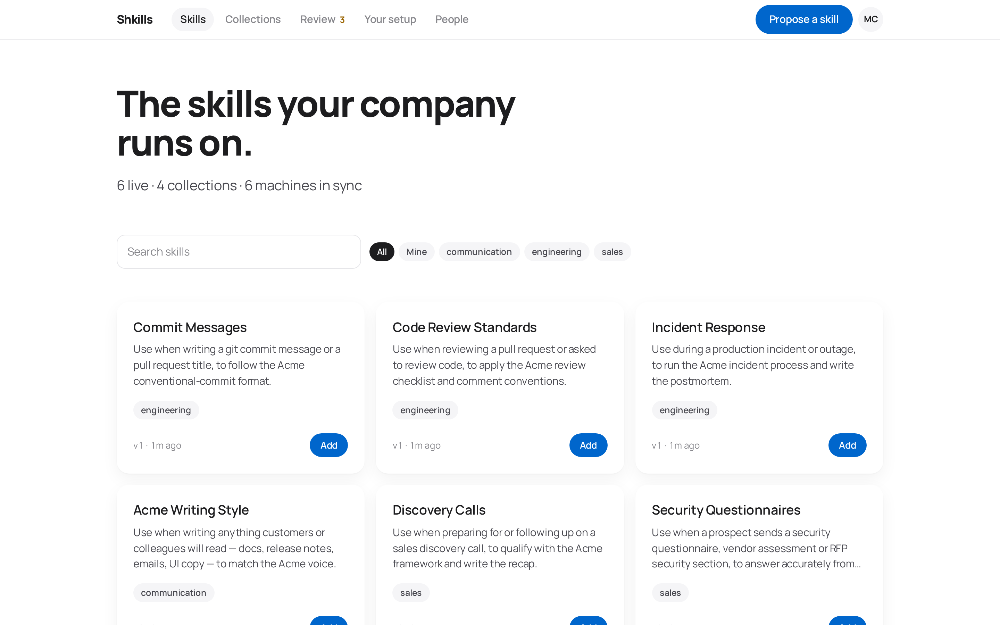
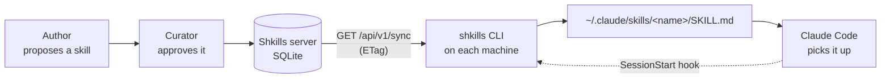

# Shkills documentation

Everything about running, using and extending Shkills — the company-wide home
for Claude skills.

  

---

## Start here

| Guide | Read it when |
| ----- | ------------ |
| [Getting started](getting-started.md) | You want Shkills running locally in five minutes |
| [Core concepts](concepts.md) | You want to know what a skill, version, collection and subscription actually are |
| [How it works](how-it-works.md) | You want the architecture and the sync protocol, in detail |

## Using it

| Guide | Contents |
| ----- | -------- |
| [The portal](portal.md) | A guided tour of every screen, with screenshots |
| [The CLI](cli.md) | Every command, every flag, real terminal output |
| [Writing skills](authoring-skills.md) | What makes a skill fire, the SKILL.md format, review etiquette |

## Running it

| Guide | Contents |
| ----- | -------- |
| [Deployment](deployment.md) | Docker, configuration, TLS, backups, upgrades |
| [Security](security.md) | The auth model, token handling, threat model, hardening |
| [Troubleshooting](troubleshooting.md) | When something looks wrong |

## Building on it

| Guide | Contents |
| ----- | -------- |
| [API reference](api.md) | Every endpoint, with request and response shapes |
| [Data model](data-model.md) | The SQLite schema, table by table |
| [Development](development.md) | Repo layout, tests, how to contribute a change |
| [Acceptance criteria](acceptance-criteria.md) | What Shkills promises, as 45 checkable statements |
| [End-to-end testing](e2e-testing.md) | The Cucumber suite that proves each of them |

---

## The one-paragraph version

Claude Code reads personal skills from `~/.claude/skills/<name>/SKILL.md`.
Shkills is a small server that holds the company's approved skill set, a portal
for proposing and reviewing changes to it, and a CLI that writes those files.
The CLI registers a `SessionStart` hook, so every Claude session refreshes the
skill set before it starts. Publish a change in the portal and it is on every
subscribed machine by the start of their next session — no daemon, no polling,
nothing anybody has to remember.

