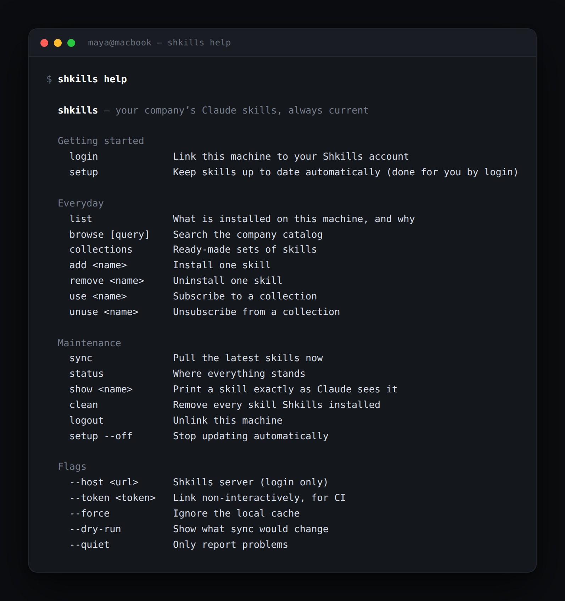
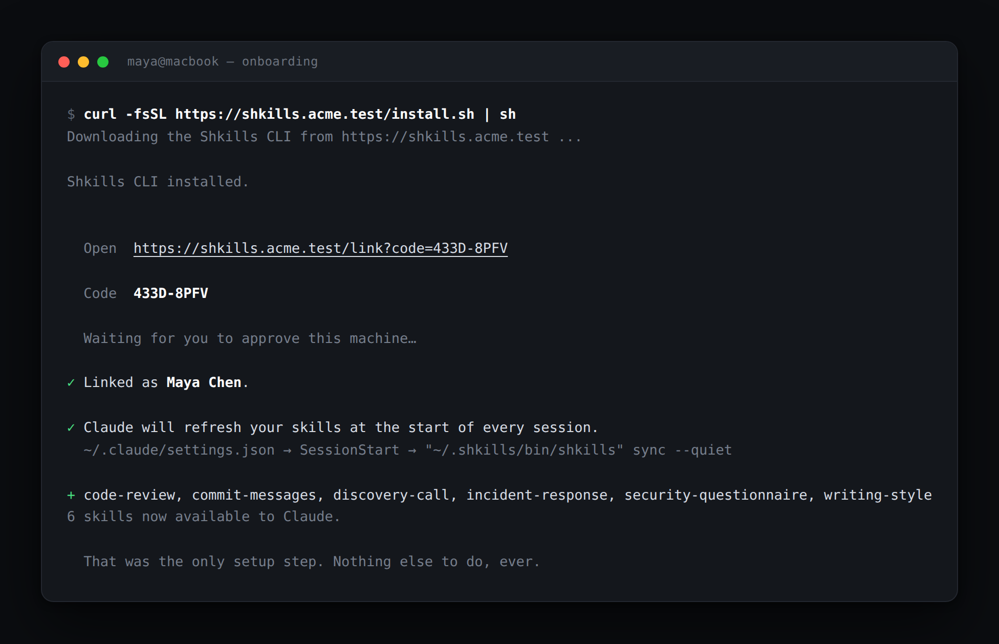
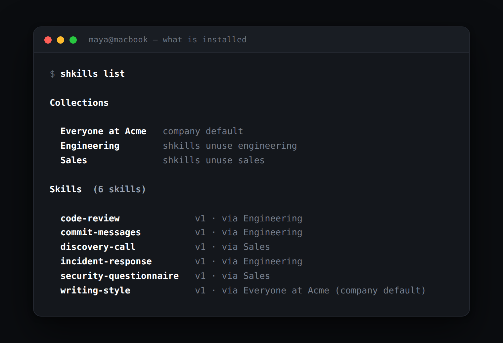
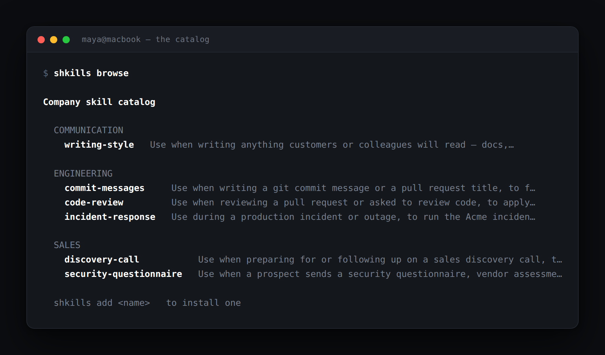
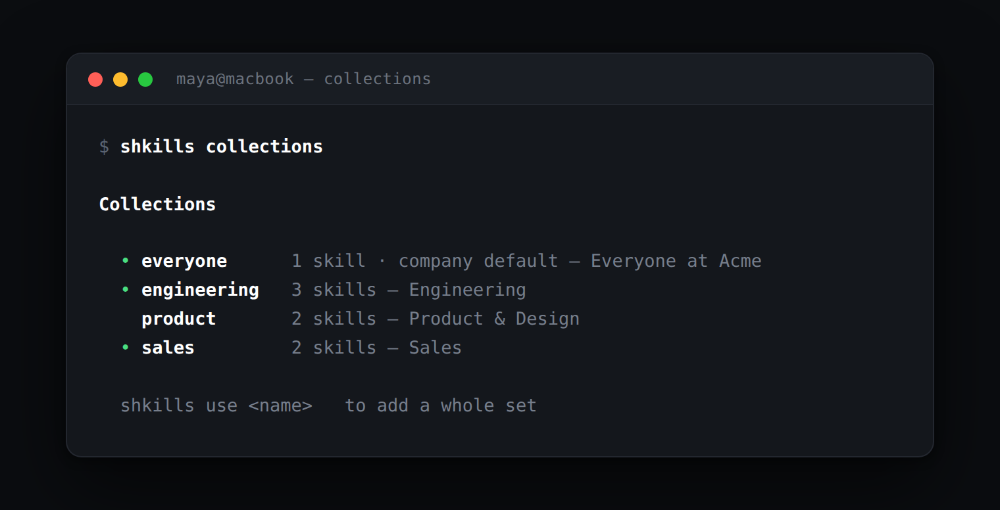

# The `shkills` CLI

One file, no runtime dependencies, and after `login` you can forget it exists.

<p align="center">
  
</p>

- [Installing](#installing)
- [Command reference](#command-reference)
  - [login / logout](#shkills-login) · [setup](#shkills-setup) · [sync](#shkills-sync) · [status](#shkills-status)
  - [list](#shkills-list) · [browse](#shkills-browse) · [collections](#shkills-collections)
  - [add / remove / use / unuse](#shkills-add-name) · [show](#shkills-show-name) · [clean](#shkills-clean)
- [Global flags](#global-flags)
- [Files it touches](#files-it-touches)
- [Environment variables](#environment-variables)
- [Non-interactive and CI use](#non-interactive-and-ci-use)

---

## Installing

```bash
curl -fsSL https://shkills.yourcompany.com/install.sh | sh
```

The installer:

1. checks for **Node.js 20+** and `curl` or `wget`,
2. downloads the bundle to `~/.shkills/bin/shkills.mjs`,
3. writes a launcher at `~/.shkills/bin/shkills`, and runs it once to check that
   what it downloaded actually executes,
4. records the server in `~/.shkills/config.json` (mode `0600` — it will hold a
   token), naming the address you fetched the script from,
5. adds `~/.shkills/bin` to `PATH` in `~/.zshrc` and `~/.bashrc` (once — it
   checks before appending), or creates `~/.profile` if you have neither,
6. runs `shkills login` if it has a terminal.

It is idempotent, and re-running it is the supported way to update: it replaces
the CLI in place and re-points the machine if the server has moved, without
unlinking it.

> The bundle is served as `.mjs` rather than `.js` on purpose. It is ESM, and
> `~/.shkills/bin` has no `package.json` to say so — Node would parse a bare
> `.js` file as CommonJS and fail.

## Command reference

### `shkills login`

Links this machine to your account. Prints a short code, waits for you to
approve it in the browser, then runs `setup` for you.

```
--host <url>     the Shkills server, if it is not already recorded
--token <token>  link non-interactively with an existing device token
```

<p align="center">
  
</p>

### `shkills logout`

Unlinks this machine. Skills already on disk are **left in place** — use
`shkills clean` to remove them.

### `shkills setup`

Registers the `SessionStart` hook in `~/.claude/settings.json` and syncs once.
`login` already does this; run it by hand if you turned it off or moved the CLI.

```
--off            remove the hook and stop updating automatically
```

Safe to run repeatedly. It rewrites its own entry rather than appending a
duplicate, and keeps a `settings.json.shkills-backup` copy.

### `shkills sync`

Pulls the current skill set and writes it to `~/.claude/skills`.

```
--force          ignore the local cache and fetch in full
--dry-run        report what would change, write nothing
--if-stale <s>   skip entirely if the last sync is younger than <s> seconds
--quiet          only report problems (what the hook uses)
```

```console
$ shkills sync
+ product-brief
↑ code-review
− discovery-call
6 skills now available to Claude.
```

`+` installed · `↑` updated · `−` removed. When nothing changed:

```console
$ shkills sync
Skills are up to date.
```

**Sync never fails loudly.** Any error is a warning and an exit code of `0`, so
a Shkills outage cannot stop a Claude session from starting.

### `shkills status`

Everything you need when something looks wrong.

<p align="center">
  
</p>

A `×` instead of `•` means the state file expects a skill that is not on disk —
`shkills sync --force` fixes it. `shkills doctor` is an alias.

### `shkills list`

What is installed here, and **why** — which collection or direct subscription
put it there. A skill of your own reads `via yours`: personal skills reach your
machines without a subscription, which is what makes them worth having on more
than one.

<p align="center">
  
</p>

`shkills ls` is an alias.

### `shkills browse [query]`

Searches the company catalog, grouped by category. A green `•` marks skills you
already have. Only published skills are listed.

Your own personal skills appear here marked `yours only`, and always with a `•`
— they are on your machines already. Nobody else's ever appear. Writing one is a
portal job; see [Visibility](concepts.md#visibility).

<p align="center">
  
</p>

```console
$ shkills browse incident

Skills matching “incident”

  ENGINEERING
    incident-response   Use during a production incident or outage, to run the Acme inciden…
```

`shkills search` is an alias.

### `shkills collections`

The ready-made sets, with how many skills each holds and which you have joined.

<p align="center">
  
</p>

### `shkills add <name>`

Subscribes to one skill and syncs immediately.

```console
$ shkills add incident-response
✓ Added incident-response.
+ incident-response
7 skills now available to Claude.
```

Subscribing to a skill that has no approved version yet is allowed — it simply
does not appear on disk until a curator publishes it.

### `shkills remove <name>`

Unsubscribes and removes the directory. `shkills rm` is an alias.

If the skill also reaches you through a collection you are in, it stays — the
subscription that removed was only the direct one.

### `shkills use <name>`

Joins a collection and syncs.

```console
$ shkills use sales
✓ Added sales.
+ discovery-call, security-questionnaire
6 skills now available to Claude.
```

### `shkills unuse <name>`

Leaves a collection. Company-default collections cannot be left — the server
returns `409`.

### `shkills show <name>`

Prints a skill exactly as Claude sees it, frontmatter and all. Useful for
checking what actually reached disk.

```console
$ shkills show commit-messages
---
name: commit-messages
description: "Use when writing a git commit message or a pull request title, to follow the Acme conventional-commit format."
---

# Commit Messages

Write every commit subject as `type(scope): summary`.
...
```

### `shkills clean`

Removes every skill Shkills installed, and **nothing else** — only directories
that still carry a `.shkills.json` marker.

```console
$ shkills clean
✓ Removed 6 skills.
```

### `shkills set-host <url>`

Points this machine at a different Shkills address — the server moved, or it
gained a DNS name and everyone should stop using its IP.

```console
$ shkills set-host http://shkills.biyou.internal
✓ Now talking to http://shkills.biyou.internal (was http://192.168.83.16:31400)
```

The link is kept: a server that gains a name is the same server, so re-pointing
does not make you log in again. If it really is a *different* server the token
will not be honoured there, and `shkills status` will say so.

Re-running the installer does this for you, which is why it is safe to leave the
install command in a laptop setup script.

### `shkills help` · `shkills version`

Prints usage and the CLI version. `--help`, `-h` and `--version` also work.

## Global flags

| Flag | Applies to | Meaning |
| ---- | ---------- | ------- |
| `--host <url>` | `login` | The Shkills server |
| `--token <tok>` | `login` | Link without a browser |
| `--force` | `sync` | Ignore the cached manifest. `add`, `remove`, `use` and `unuse` already sync this way. |
| `--dry-run` | `sync` | Report changes without making them |
| `--if-stale <s>` | `sync` | No-op if the last sync is newer than `<s>` seconds |
| `--quiet` | any | Suppress normal output; warnings and errors still print |
| `--off` | `setup` | Remove the hook |

## Files it touches

| Path | Contents |
| ---- | -------- |
| `~/.shkills/config.json` | Server URL, device token, your name and email. Mode `0600`. |
| `~/.shkills/state.json` | Last manifest, last sync time, and the version + checksum of every managed skill. |
| `~/.shkills/bin/shkills` | The launcher the installer writes. |
| `~/.shkills/bin/shkills.mjs` | The bundle. |
| `~/.claude/settings.json` | Gains one `SessionStart` hook entry. Backed up to `settings.json.shkills-backup` before any write. |
| `~/.claude/skills/<slug>/SKILL.md` | What Claude reads. |
| `~/.claude/skills/<slug>/.shkills.json` | The marker that says this directory is managed. |

Nothing else on your machine is modified, ever.

## Environment variables

| Variable | Effect |
| -------- | ------ |
| `SHKILLS_HOME` | Where config and state live. Default `~/.shkills`. |
| `SHKILLS_HOST` | Overrides the recorded server URL for one run. To change it for good, use `set-host`. |
| `SHKILLS_TOKEN` | Overrides the stored device token. |
| `SHKILLS_HOSTNAME` | The name this machine announces when linking — what the portal shows next to "Is this you on …?". Defaults to the system hostname; worth setting on a container or a shared build box. |
| `CLAUDE_CONFIG_DIR` | Where Claude's config lives. Default `~/.claude`. Honoured by Claude Code too. |
| `NO_COLOR` | Disables colour. Colour is also off automatically when stdout is not a TTY. |

Setting the first two is the tidy way to try Shkills without touching your real
Claude setup:

```bash
export SHKILLS_HOME="$PWD/.demo/shkills"
export CLAUDE_CONFIG_DIR="$PWD/.demo/claude"
```

## Non-interactive and CI use

Build images and shared machines cannot open a browser. Mint a token by linking
once interactively, then reuse it:

```bash
shkills login --host https://shkills.yourcompany.com --token "$SHKILLS_TOKEN"
shkills sync --quiet
```

Or skip `login` entirely and pass the token through the environment:

```bash
export SHKILLS_HOST=https://shkills.yourcompany.com
export SHKILLS_TOKEN=shk_4ff68dc8_…
shkills sync --quiet
```

Tokens are per-device and individually revocable from *Your setup* in the
portal, so a leaked CI token is one click to kill.

Add `--if-stale 3600` if you invoke sync more often than once an hour and want to
avoid the round trip.
