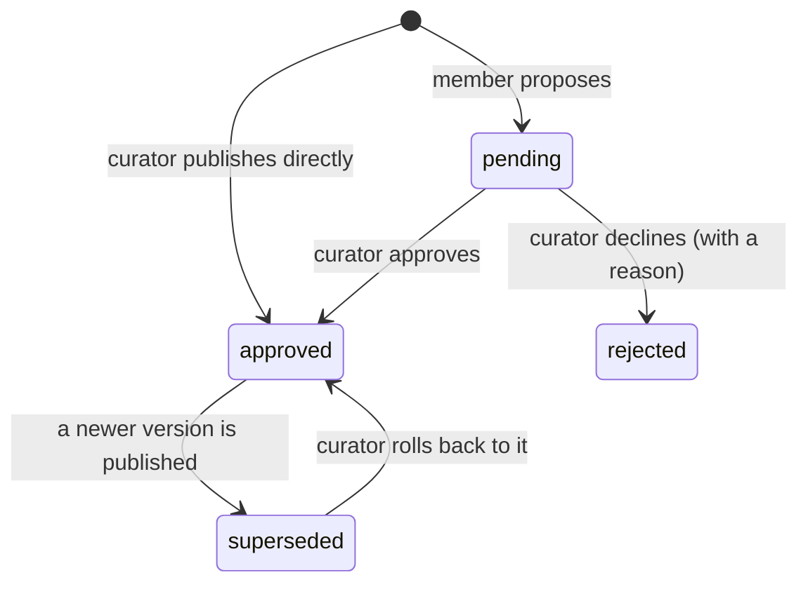
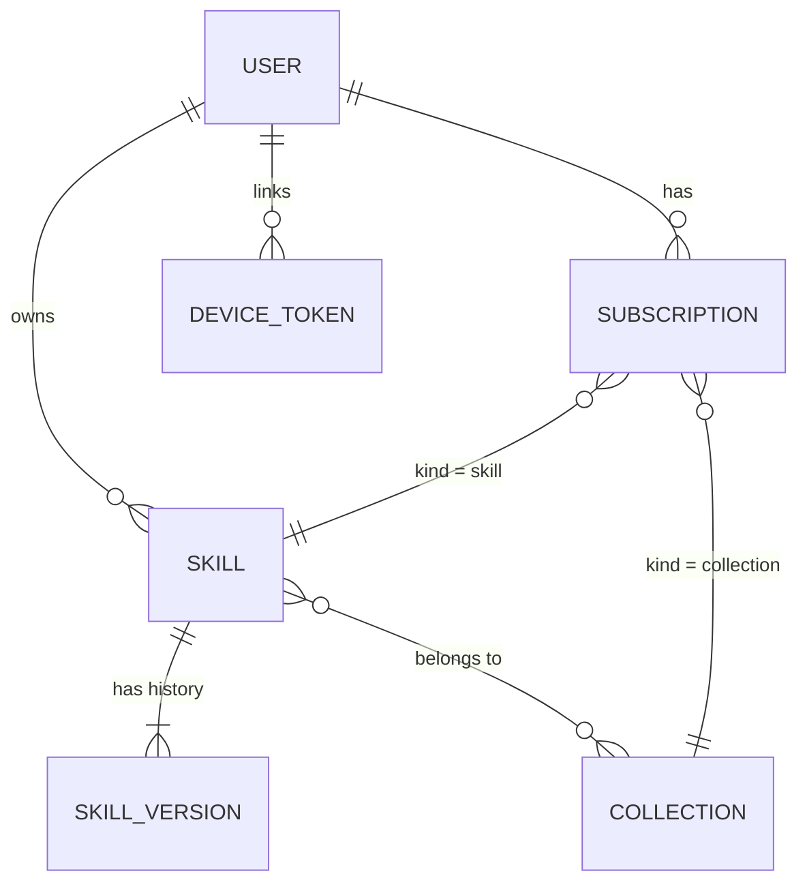

# Core concepts

Five nouns and one verb. Once these are clear, the rest of Shkills is obvious.

- [Skill](#skill)
- [Visibility](#visibility)
- [Version](#version)
- [Collection](#collection)
- [Subscription](#subscription)
- [Role](#role)
- [Sync](#sync)
- [How they fit together](#how-they-fit-together)

---

## Skill

A **skill** is a named instruction set that Claude reaches for on its own. It has:

| Field | Why it matters |
| ----- | -------------- |
| **Name** (slug) | Becomes the directory: `~/.claude/skills/<slug>/SKILL.md`. Lowercase words separated by single hyphens. |
| **Title** | What people see in the catalog. |
| **Description** | **The single most important field.** Claude decides whether to use a skill from this sentence alone. |
| **Category** | One word, drives the filter chips. |
| **Audiences** | Who it is for — engineering, sales, product… Purely for finding it. |
| **Tags** | Free-form, searchable. |
| **Instructions** | The body. Markdown. This is what Claude follows once it has decided to. |
| **User-invocable** | When on, adds a `/<slug>` command as well as automatic triggering. |
| **Allowed tools** | Optional passthrough to the `allowed-tools` frontmatter key. |

Skills are owned by whoever created them. The owner or a curator can archive one;
only an admin can purge it permanently.

> A skill's description is not documentation, it is a **trigger**. See
> [Writing skills](authoring-skills.md) for how to get it right.

## Visibility

A skill is either **shared** — a company skill, the default, everything above —
or **personal**.

A personal skill exists because trying one out used to mean publishing it, since
publishing was the only way onto a machine. So every experiment reached
everybody. A personal skill is the same skill with a smaller audience:

| | Shared | Personal |
| --- | --- | --- |
| Review | Members propose; a curator approves | None, whoever writes it |
| Who can see it | Everybody | Its owner. A curator too, but only while an offer to share it is waiting |
| How it reaches a machine | Subscribe, or join a collection that has it | Its owner's machines, with no subscription |
| Can go in a collection | Yes | No — a collection hands its skills to everyone who joins it |

**Offering it to the company** is a request about the skill, not about a
version: `share_status` goes to `pending`, a curator sees it in the review
queue, and approving only widens who may install it. Nothing is written to the
version history, so the copy the owner is already running is untouched whichever
way the answer goes — declining takes nothing off their machines, and hands back
a reason.

Going the other way is refused. A shared skill may already be on other people's
machines, and quietly making it private would delete it from them. **Archiving**
is that operation, and it says what it is doing.

One consequence worth knowing: slugs are unique across the whole instance,
including personal ones. The slug is the directory name under
`~/.claude/skills/`, so two skills of one name could never both be installed
anyway — the namespace is global because the filesystem is. Asking for a name
somebody's private skill already holds is refused, and the refusal says the name
is taken and nothing else.

## Version

**Every change creates a version.** A skill points at exactly one *published*
version; everything else is history.



| Status | Meaning |
| ------ | ------- |
| `pending` | Waiting in the review queue. Not on anybody's machine. |
| `approved` | The live version. This is what syncs. |
| `rejected` | Declined, with a note explaining why. Kept for the record. |
| `superseded` | Was live once; a newer version replaced it. Can be rolled back to. |
| `draft` | Reserved; the current UI does not produce these. |

Two properties fall out of this design and both matter:

- **A review in flight never takes the live skill away from anyone.** Proposing
  v4 leaves v3 published until somebody approves v4.
- **Rollback is not a delete.** It republishes an older version, which means
  every machine returns to it on the next sync.

Each version carries a **checksum** — a SHA-256 of the exact rendered
`SKILL.md`, truncated to 16 hex characters. That is how the CLI knows whether a
file on disk is current without diffing it.

## Collection

A **collection** is a set of skills people join in one decision — "Backend
Engineering", "Sales", "Everyone at Acme". Adding a skill to a collection
installs it for everyone in that collection, automatically, on their next sync.

<p align="center">
  
</p>

Collections marked **company default** apply to everybody and cannot be opted out
of. That is the mechanism that makes "everyone uses the same skills" true rather
than aspirational — the API returns `409` if you try to unsubscribe from one.

Curators create and manage collections. Anyone can join a non-default one.

## Subscription

A **subscription** is the link between a person and what they get. There are
exactly two kinds:

- `skill` — I want this one skill.
- `collection` — I want this whole set, including whatever gets added to it later.

Your **effective skill set** is the union of:

1. your direct skill subscriptions,
2. every skill in every collection you joined,
3. every skill in every **company default** collection,
4. every **personal** skill you own — no subscription involved. Syncing your own
   drafts between your own machines should not need a second decision.

Archived skills and skills with no published version are excluded. The portal and
`shkills list` both show *why* you have each skill:

<p align="center">
  
</p>

## Role

Three roles, each a superset of the one before it.

| Role | Can |
| ---- | --- |
| `member` | Browse, subscribe, propose new skills and revisions |
| `curator` | …plus approve, reject, roll back, publish directly, manage collections, see the audit log |
| `admin` | …plus manage people, change roles, deactivate accounts, purge skills |

Curators publish their own work directly rather than approving their own
proposals — that is ceremony, not review. The editor still offers an explicit
*"send it for review instead"* option when they want a second pair of eyes.

The **first account created on a fresh deployment becomes the administrator**, so
a new install is usable without touching a console. Shkills also refuses to
demote or deactivate the last remaining admin.

## Sync

**Sync** is the verb. It means: ask the server for my effective skill set, and
make `~/.claude/skills` match it.

It runs automatically, once per Claude session, via a `SessionStart` hook that
`shkills login` registers in `~/.claude/settings.json`:

```json
{
  "hooks": {
    "SessionStart": [
      {
        "hooks": [
          {
            "type": "command",
            "command": "\"~/.shkills/bin/shkills\" sync --quiet",
            "timeout": 20
          }
        ]
      }
    ]
  }
}
```

The one rule sync exists to enforce: **it never touches a directory Shkills did
not create.** Every managed directory carries a `.shkills.json` marker. A
name collision with a skill you wrote by hand is skipped with a warning, not
overwritten. Delete the marker and the directory is yours permanently.

See [How it works](how-it-works.md) for the protocol details.

## How they fit together



A concrete walk-through:

1. Dan (`member`) writes a **skill** called `product-brief`. It becomes v1,
   status `pending`.
2. Rob (`curator`) opens **Review**, reads it, and approves. v1 becomes the
   published **version**.
3. Rob adds `product-brief` to the **Product & Design** collection.
4. Everyone with a **subscription** to that collection now has it in their
   effective set.
5. Their next Claude session runs the `SessionStart` hook, which **syncs**, and
   `~/.claude/skills/product-brief/SKILL.md` appears.

Nobody in step 4 did anything.
