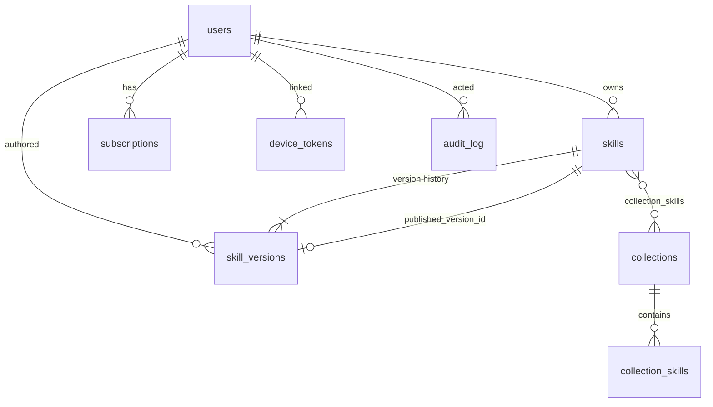

# Data model

One SQLite file, nine tables, no migrations framework. The schema is created with
`CREATE TABLE IF NOT EXISTS` at startup, so a new version adds what it needs on
boot.

```sql
PRAGMA journal_mode = WAL;
PRAGMA foreign_keys = ON;
```

- [Overview](#overview) · [users](#users) · [skills](#skills) · [skill_versions](#skill_versions)
- [collections](#collections) · [collection_skills](#collection_skills)
- [subscriptions](#subscriptions) · [device_tokens](#device_tokens) · [device_auth](#device_auth)
- [audit_log](#audit_log) · [Indexes](#indexes) · [Useful queries](#useful-queries)

---

## Overview



The one structural subtlety: `skills.published_version_id` is a
`DEFERRABLE INITIALLY DEFERRED` foreign key into `skill_versions`, while
`skill_versions.skill_id` points back. Creating a skill and its first version in
one transaction would otherwise be impossible.

---

## `users`

| Column | Type | Notes |
| ------ | ---- | ----- |
| `id` | INTEGER PK | |
| `email` | TEXT UNIQUE | Lowercased and trimmed on the way in |
| `name` | TEXT | |
| `password_hash` | TEXT | bcrypt, cost 10 |
| `role` | TEXT | `member` · `curator` · `admin`. Default `member` |
| `department` | TEXT | Default `engineering`. Informational |
| `active` | INTEGER | `0` deactivates every session and device at once |
| `created_at` | TEXT | |

The first row ever inserted gets `role = 'admin'`. The API refuses any update
that would leave zero active admins.

## `skills`

The stable identity. Content lives in versions.

| Column | Type | Notes |
| ------ | ---- | ----- |
| `id` | INTEGER PK | |
| `slug` | TEXT UNIQUE | The directory name under `~/.claude/skills/` |
| `owner_id` | INTEGER → `users` | Can archive their own skill |
| `published_version_id` | INTEGER → `skill_versions`, nullable | **`NULL` means nothing is live yet.** Deferred FK |
| `archived` | INTEGER | `1` stops it syncing everywhere; history is kept |
| `created_at`, `updated_at` | TEXT | `updated_at` bumps on publish and archive |

## `skill_versions`

Append-only. Every change is a new row.

| Column | Type | Notes |
| ------ | ---- | ----- |
| `id` | INTEGER PK | |
| `skill_id` | INTEGER → `skills` | `ON DELETE CASCADE` |
| `version` | INTEGER | 1-based. `UNIQUE (skill_id, version)` |
| `title` | TEXT | |
| `description` | TEXT | The trigger sentence |
| `category` | TEXT | Default `general` |
| `audiences` | TEXT | **JSON array** |
| `tags` | TEXT | **JSON array** |
| `allowed_tools` | TEXT, nullable | Frontmatter passthrough |
| `user_invocable` | INTEGER | `1` adds a `/<slug>` command |
| `body` | TEXT | The instructions, Markdown |
| `change_note` | TEXT | What changed and why |
| `status` | TEXT | `draft` · `pending` · `approved` · `rejected` · `superseded` |
| `author_id` | INTEGER → `users` | |
| `reviewer_id` | INTEGER → `users`, nullable | |
| `review_note` | TEXT, nullable | Required on reject; `'rollback'` on a rollback |
| `checksum` | TEXT | SHA-256 of the **rendered `SKILL.md`**, first 16 hex chars |
| `created_at`, `reviewed_at` | TEXT | |

Only one version per skill is `approved` at a time — publishing marks the
previous one `superseded` in the same transaction.

`checksum` is computed over the fully rendered file, not the body, so a change to
the description or the version number changes it. That is what makes it safe for
the CLI to skip a rewrite.

## `collections`

| Column | Type | Notes |
| ------ | ---- | ----- |
| `id` | INTEGER PK | |
| `slug` | TEXT UNIQUE | |
| `name`, `description` | TEXT | |
| `audience` | TEXT | Default `general` |
| `is_default` | INTEGER | **`1` = auto-subscribed for everyone, no opt-out** |
| `created_by` | INTEGER → `users` | |
| `created_at` | TEXT | |

## `collection_skills`

| Column | Type | Notes |
| ------ | ---- | ----- |
| `collection_id` | INTEGER → `collections` | `ON DELETE CASCADE` |
| `skill_id` | INTEGER → `skills` | `ON DELETE CASCADE` |
| `position` | INTEGER | Display order |

`PRIMARY KEY (collection_id, skill_id)` — a skill appears at most once per
collection.

## `subscriptions`

| Column | Type | Notes |
| ------ | ---- | ----- |
| `id` | INTEGER PK | |
| `user_id` | INTEGER → `users` | `ON DELETE CASCADE` |
| `kind` | TEXT | `skill` or `collection` |
| `target_id` | INTEGER | Polymorphic — resolved by `kind`, so no FK |
| `created_at` | TEXT | |

`UNIQUE (user_id, kind, target_id)`.

**Company-default collections are not stored here.** They apply by virtue of
`collections.is_default`, which is exactly what makes them impossible to opt out
of.

## `device_tokens`

| Column | Type | Notes |
| ------ | ---- | ----- |
| `id` | INTEGER PK | |
| `user_id` | INTEGER → `users` | `ON DELETE CASCADE` |
| `name` | TEXT | The machine's hostname |
| `token_hash` | TEXT UNIQUE | **SHA-256 of the token. The plaintext is never stored.** |
| `prefix` | TEXT | 8 hex chars, so the UI can identify a token it does not hold |
| `created_at`, `last_used_at`, `last_sync_at` | TEXT | `last_sync_at` drives the adoption numbers |
| `revoked_at` | TEXT, nullable | Non-null → every lookup fails immediately |

## `device_auth`

Short-lived rows for the login flow.

| Column | Type | Notes |
| ------ | ---- | ----- |
| `device_code` | TEXT PK | 32 random bytes, base64url. The CLI's secret |
| `user_code` | TEXT UNIQUE | The 8-character code you read out loud |
| `hostname` | TEXT | Shown on the approval screen |
| `user_id` | INTEGER → `users`, nullable | Set on approval |
| `token` | TEXT, nullable | **The plaintext token, for exactly one pickup, then nulled** |
| `status` | TEXT | `pending` · `approved` · `claimed` · `denied` |
| `created_at`, `expires_at` | TEXT | 15-minute TTL; expired rows swept on each new code |

## `audit_log`

Append-only. No API modifies or deletes a row.

| Column | Type | Notes |
| ------ | ---- | ----- |
| `id` | INTEGER PK | |
| `actor_id` | INTEGER → `users`, nullable | |
| `action` | TEXT | e.g. `skill.approve` |
| `entity`, `entity_id` | TEXT, INTEGER | e.g. `skill`, `7` |
| `detail` | TEXT | Free-form context |
| `created_at` | TEXT | |

## Indexes

```sql
idx_versions_skill   ON skill_versions(skill_id)
idx_versions_status  ON skill_versions(status)     -- the review queue
idx_subs_user        ON subscriptions(user_id)     -- the sync query
idx_audit_created    ON audit_log(created_at DESC)
```

Plus the implicit indexes behind every `UNIQUE` and `PRIMARY KEY`.

## Useful queries

**Who has not synced in a week**

```sql
SELECT u.name, u.email, MAX(d.last_sync_at) AS last_sync
  FROM users u
  LEFT JOIN device_tokens d ON d.user_id = u.id AND d.revoked_at IS NULL
 WHERE u.active = 1
 GROUP BY u.id
HAVING last_sync IS NULL OR last_sync < datetime('now', '-7 days')
 ORDER BY last_sync;
```

**Which skills nobody is subscribed to**

```sql
SELECT s.slug
  FROM skills s
 WHERE s.archived = 0
   AND s.id NOT IN (SELECT target_id FROM subscriptions WHERE kind = 'skill')
   AND s.id NOT IN (SELECT skill_id FROM collection_skills);
```

**The review queue, with how long each has waited**

```sql
SELECT sk.slug, v.version, u.name AS author,
       CAST(julianday('now') - julianday(v.created_at) AS INT) AS days_waiting
  FROM skill_versions v
  JOIN skills sk ON sk.id = v.skill_id
  JOIN users  u  ON u.id  = v.author_id
 WHERE v.status = 'pending'
 ORDER BY v.created_at;
```

**Everything one person did**

```sql
SELECT created_at, action, entity, detail
  FROM audit_log
 WHERE actor_id = (SELECT id FROM users WHERE email = 'rob@acme.test')
 ORDER BY id DESC LIMIT 100;
```

**Reading it live**

```bash
sqlite3 packages/server/data/shkills.sqlite
```

Read-only queries against a running server are safe — WAL mode allows concurrent
readers.
