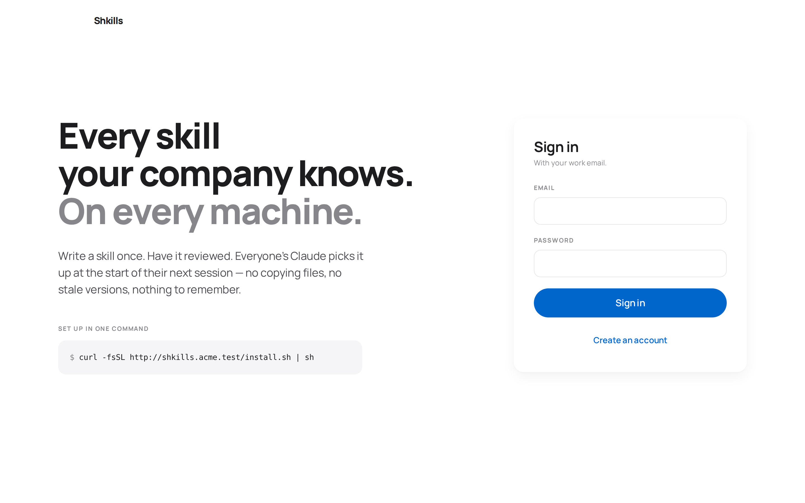

# Getting started

Five minutes from a clone to a working company skill platform with sample data.

- [Run it locally](#run-it-locally)
- [Sign in](#sign-in)
- [Link your first machine](#link-your-first-machine)
- [Publish a change and watch it land](#publish-a-change-and-watch-it-land)
- [Development mode](#development-mode)
- [Where to go next](#where-to-go-next)

---

## Run it locally

You need **Node.js 20 or newer**. Nothing else — the database is a SQLite file
the server creates for you.

```bash
git clone https://github.com/ydbondt/shkills.git
cd shkills

npm install
npm run seed     # a sample company: 5 people, 9 skills, 4 collections
npm run build
npm start        # http://localhost:4000
```

`npm run seed` is safe to skip if you would rather start empty — the first
account you create on a fresh database becomes the administrator.

> **Note**
> `npm run seed` refuses to run against a database that already has data. Pass
> `--force` if you really want to add the sample company on top of real records.

## Sign in

Open <http://localhost:4000>. Every seeded account uses the password
`shkills123`.

<p align="center">
  
</p>

| Account            | Role      | What they can do                                    |
| ------------------ | --------- | --------------------------------------------------- |
| `maya@acme.test`   | `admin`   | Everything, plus managing people                     |
| `rob@acme.test`    | `curator` | Approve, publish, manage collections                 |
| `sofia@acme.test`  | `curator` | Same, in the sales department                        |
| `dan@acme.test`    | `member`  | Propose skills, subscribe                            |
| `ines@acme.test`   | `member`  | Propose skills, subscribe                            |

Sign in as **Maya** to see the whole surface, including *Review* and *People*.
There are three proposals waiting in the queue.

## Link your first machine

The portal's *Your setup* page has the one command that onboards a machine.
Locally, that is:

```bash
curl -fsSL http://localhost:4000/install.sh | sh
```

The installer checks for Node 20+, downloads the CLI bundle, drops a launcher in
`~/.shkills/bin`, adds that directory to your `PATH`, records which server to
talk to, and — when it has a terminal — hands straight over to `shkills login`.

Login prints a short code and a URL. Approving it in the browser finishes
everything, including the automatic-update hook:

<p align="center">
  
</p>

That is the whole onboarding. There is no second step.

> **Warning**
> The installer writes to `~/.shkills` and appends a `PATH` line to your shell
> rc file, and `shkills login` adds a `SessionStart` hook to
> `~/.claude/settings.json`. If you would rather not touch your real Claude
> config while trying this out, point the CLI somewhere else first:
>
> ```bash
> export SHKILLS_HOME="$PWD/.demo/shkills"
> export CLAUDE_CONFIG_DIR="$PWD/.demo/claude"
> ```

Check what landed:

<p align="center">
  
</p>

And on disk:

```
~/.claude/skills/
├── code-review/
│   ├── SKILL.md          ← what Claude reads
│   └── .shkills.json     ← "Shkills owns this directory"
├── commit-messages/
├── discovery-call/
├── incident-response/
├── security-questionnaire/
└── writing-style/
```

## Publish a change and watch it land

1. In the portal, open a skill and press **Edit**.
2. Change something and publish. As a curator you publish directly; as a member
   you send it for review and a curator approves it from **Review**.
3. On the machine, run `shkills sync` — or just start a new Claude session,
   which does it for you.

```console
$ shkills sync
↑ code-review
6 skills now available to Claude.
```

## Development mode

For hot reload, run the API and the web app separately:

```bash
npm run dev -w @shkills/server    # :4000, tsx watch
npm run dev -w @shkills/web       # :5173, proxies /api to :4000
```

Then browse to <http://localhost:5173>.

Useful scripts from the repo root:

| Command | What it does |
| ------- | ------------ |
| `npm run build` | Builds CLI, web and server, in that order |
| `npm test` | Runs every workspace's tests |
| `npm run typecheck` | `tsc --noEmit` across all three packages |
| `npm run seed` | Fills an empty database with the sample company |
| `npm start` | Runs the built server |

## Where to go next

- [Core concepts](concepts.md) — skills, versions, collections, subscriptions, roles
- [Writing skills](authoring-skills.md) — how to write one Claude actually reaches for
- [Deployment](deployment.md) — putting it in front of your company
