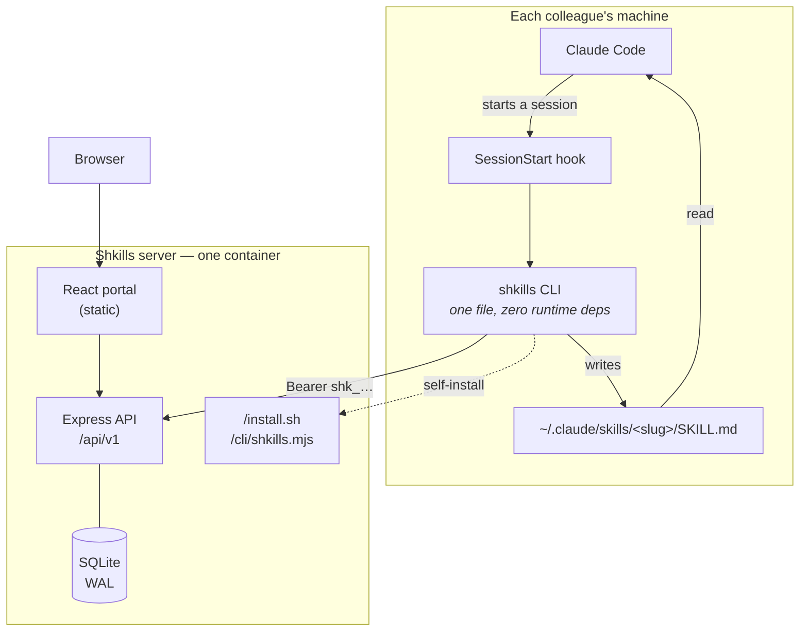
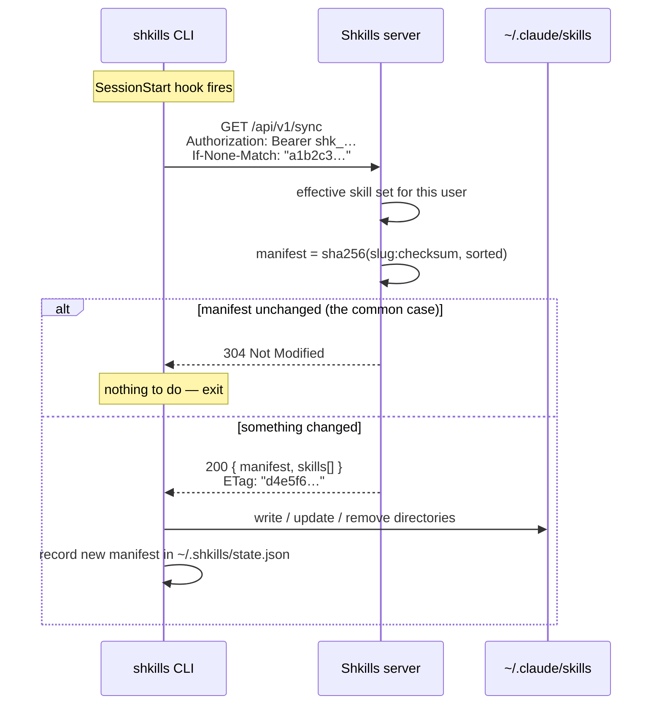
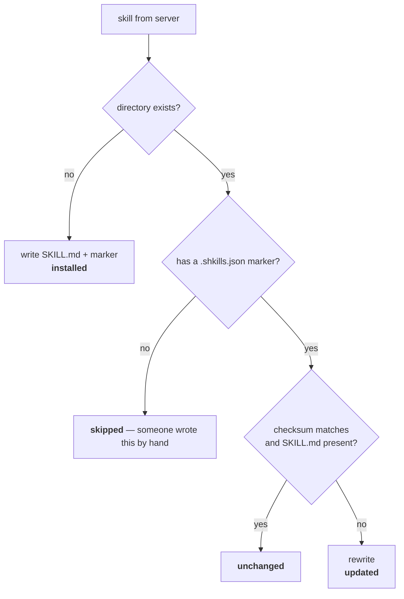
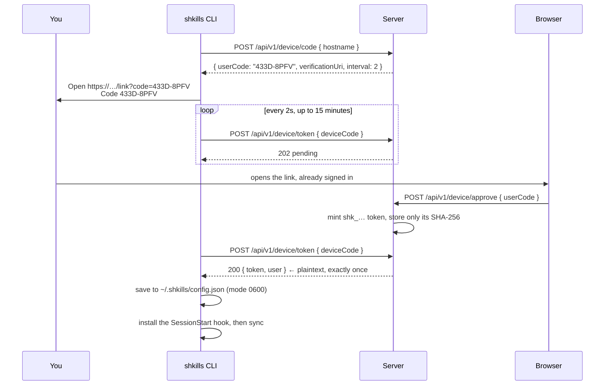

# How it works

The architecture, the sync protocol, and the design decisions behind both.

- [The whole system on one page](#the-whole-system-on-one-page)
- [Why a SessionStart hook](#why-a-sessionstart-hook)
- [The sync protocol](#the-sync-protocol)
- [Why the server renders SKILL.md](#why-the-server-renders-skillmd)
- [How sync decides what to write](#how-sync-decides-what-to-write)
- [Never clobbering your own skills](#never-clobbering-your-own-skills)
- [Device login](#device-login)
- [Failure modes](#failure-modes)

---

## The whole system on one page

Three packages, one process in production.



| Package | What it is |
| ------- | ---------- |
| `packages/server` | Express + `better-sqlite3`. The API, the approval workflow, the sync endpoint, and the installer script. Also serves the built portal. |
| `packages/web` | React + Vite single-page app. The portal. |
| `packages/cli` | The CLI, bundled with esbuild into **one `.mjs` file with no runtime dependencies**. The server hands it out at `/cli/shkills.mjs`. |

The whole thing ships as a single container with a single SQLite file. There is
no queue, no cache, no second service.

## Why a SessionStart hook

The alternatives, and why they lose:

| Approach | Problem |
| -------- | ------- |
| A background daemon | Something else to install, supervise and debug on every laptop. Dies silently. |
| A cron job | Fires when nobody is working; still stale at the moment it matters. |
| "Run `shkills sync` when you remember" | Nobody remembers. This is the exact failure Shkills exists to fix. |
| A `SessionStart` hook | Runs at the only moment that matters — right before Claude reads the skills. Costs one HTTP request. |

The hook is the entire propagation mechanism. It means the freshness guarantee is
precise and easy to state:

> **Every Claude session starts with the current approved skill set.**

Not "within five minutes", not "after you remember to pull". At the start of the
session, which is when Claude reads the files anyway.

## The sync protocol

One endpoint. `GET /api/v1/sync`, authenticated with a device token.



The **manifest** is a stable fingerprint of a whole skill set:

```
sha256( "code-review:901d03bb91318b78\ncommit-messages:…" ).slice(0, 16)
```

Slugs sorted, one `slug:checksum` pair per line. Any change to any skill anyone
is subscribed to — content, subscription, archive, rollback — produces a
different manifest, and nothing else does.

Because the manifest is the ETag, the steady state costs a conditional request
that returns **304 with no body**. Starting a Claude session on a day when
nothing changed is one small query and no payload.

Sync also stamps `device_tokens.last_sync_at`, which is what powers the
"machines in sync" numbers in the portal.

## Why the server renders SKILL.md

The CLI never assembles frontmatter. It receives the exact bytes to write:

```markdown
---
name: commit-messages
description: "Use when writing a git commit message or a pull request title, to follow the Acme conventional-commit format."
---

# Commit Messages

Write every commit subject as `type(scope): summary`.

...

---

<!-- Managed by Shkills. Category: engineering · Version: 1 · Audience: engineering · Tags: git, conventions -->
<!-- Local edits are overwritten on the next sync. Propose changes in the Shkills portal. -->
```

This is deliberate. **The `SKILL.md` format is Claude's, not ours.** When it
evolves — a new frontmatter key, a changed convention — the fix ships in one
place, and every CLI already installed picks it up on its next sync. Nobody has
to upgrade anything.

The trailing HTML comments are invisible to a Markdown reader but tell anyone
who opens the file where it came from and that editing it locally is pointless.

## How sync decides what to write

For each skill in the response:



Then, for every slug recorded in local state that the server did *not* return —
unsubscribed, archived, or deleted centrally — the directory is removed, unless
it has lost its marker, in which case it is left alone.

The result is reported honestly:

```console
$ shkills sync
+ product-brief
↑ code-review
− discovery-call
6 skills now available to Claude.
```

`--dry-run` computes all of this and writes nothing.

## Never clobbering your own skills

This is the invariant the sync engine exists to protect:

> **Shkills only ever modifies or deletes a directory it created.**

Enforced by a marker file written next to every managed `SKILL.md`:

```json
{
  "managedBy": "shkills",
  "slug": "code-review",
  "version": 1,
  "checksum": "901d03bb91318b78",
  "syncedAt": "2026-07-31T11:29:24.689Z"
}
```

- No marker → not ours → never touched, and a warning is printed instead.
- Delete the marker → ownership returns to you, permanently.
- `shkills clean` removes only directories that still carry a marker.

Losing somebody's hand-written skill to a name collision would be far worse than
a company skill failing to install, so the tie always breaks in the human's
favour.

## Device login

The CLI never sees a password. It uses the OAuth device-authorization shape,
because the browser is where the user is already signed in.



Details that matter:

- The user code alphabet is `BCDFGHJKLMNPQRSTVWXZ23456789` — no vowels, no
  look-alike glyphs. You can read it out loud without spelling it.
- Codes expire after **15 minutes**, and expired rows are swept on each new
  request.
- The plaintext token exists in the database for exactly one pickup, then the
  column is nulled and the row marked `claimed`.
- Only the SHA-256 of a token is ever stored long-term.
- Every device is individually revocable from *Your setup*.

## Failure modes

Sync runs on the critical path of starting Claude, so it is built to be
invisible when things go wrong.

| What happens | What the user sees |
| ------------ | ------------------ |
| Server unreachable | A warning on stderr. Claude starts normally with the skills already on disk. |
| Token revoked or expired (`401`) | `your Shkills login expired — run 'shkills login' to relink this machine`. Claude still starts. |
| Request takes too long | Timed out at 12s; hook timeout is 20s. Claude still starts. |
| Name collides with your own skill | That one skill is skipped with a warning. Everything else installs. |
| `~/.claude/settings.json` is not valid JSON | `shkills setup` refuses to write and tells you to fix it. A backup copy is kept at `settings.json.shkills-backup` whenever it does write. |

**A Shkills outage never stops anyone from starting Claude.** Every failure path
returns `0`.
