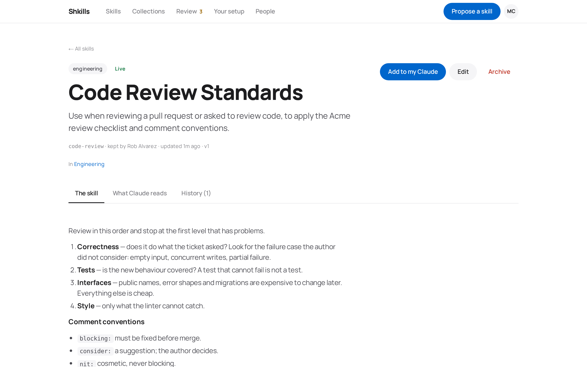
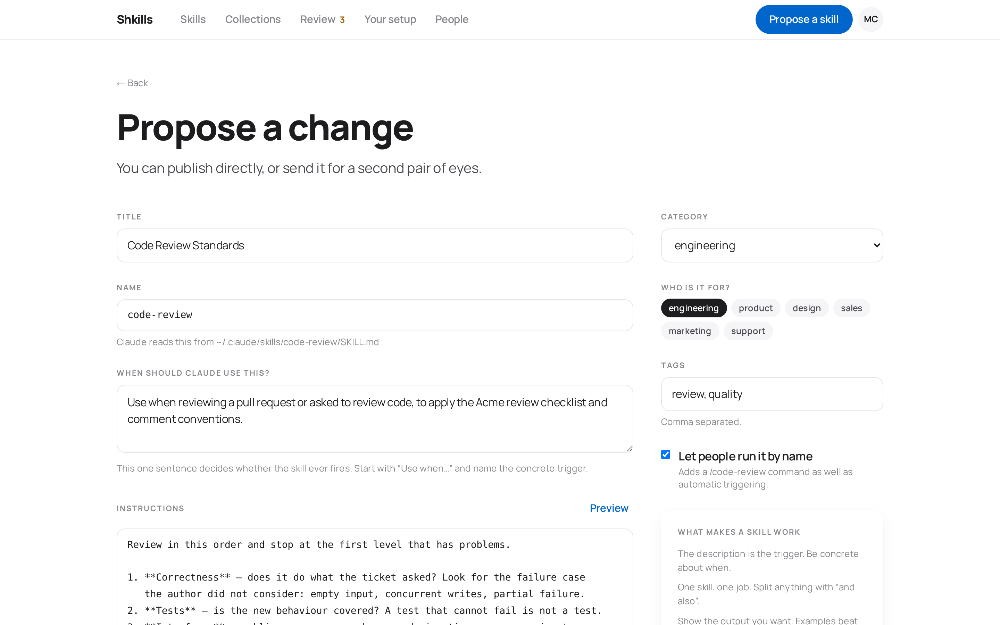
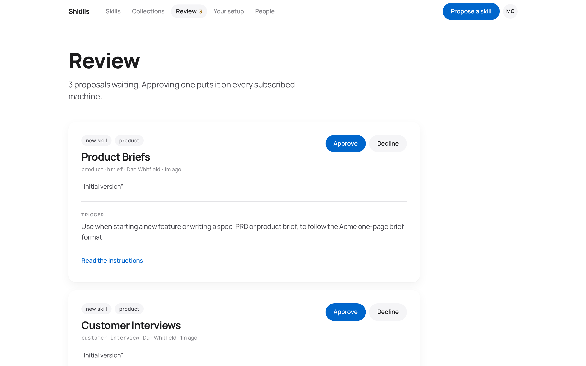
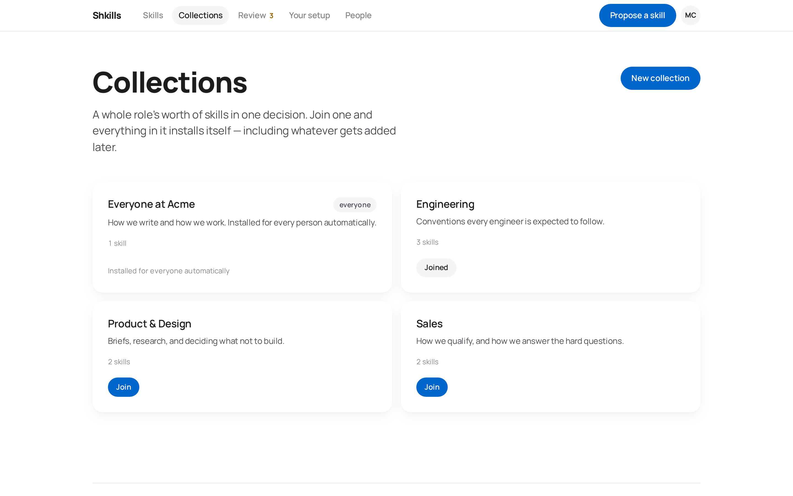
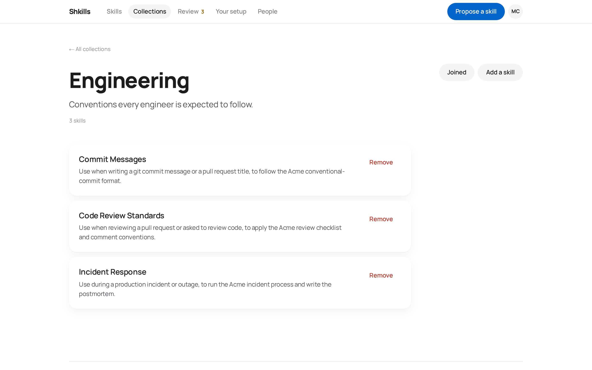
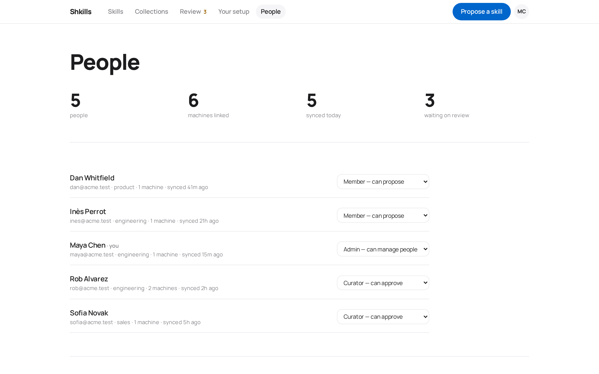
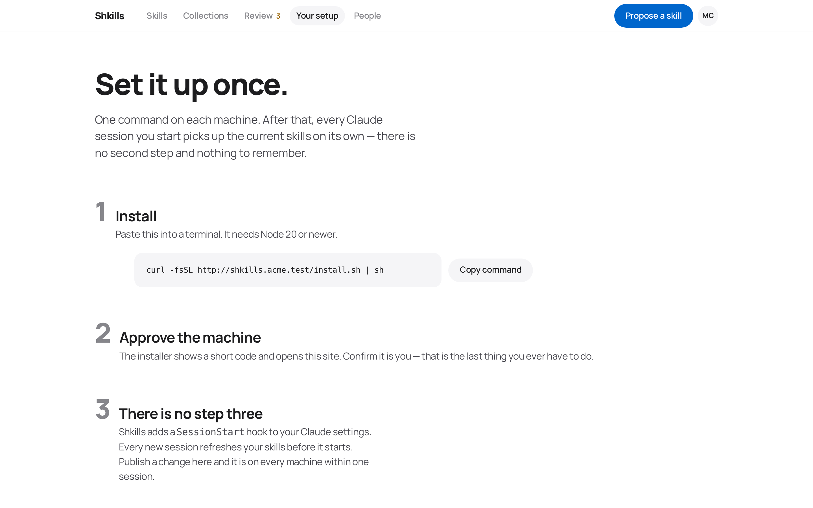
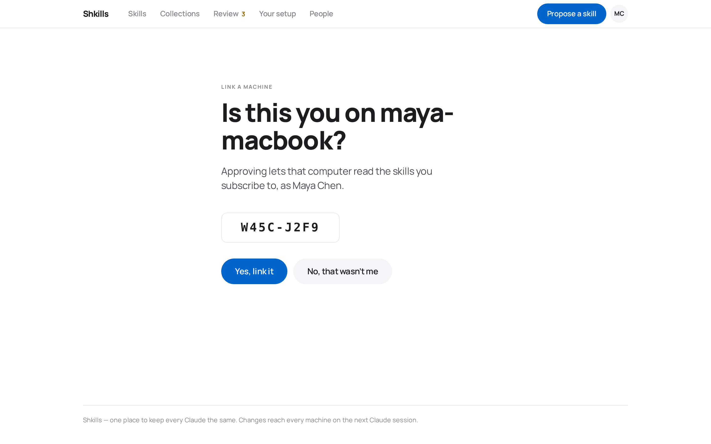
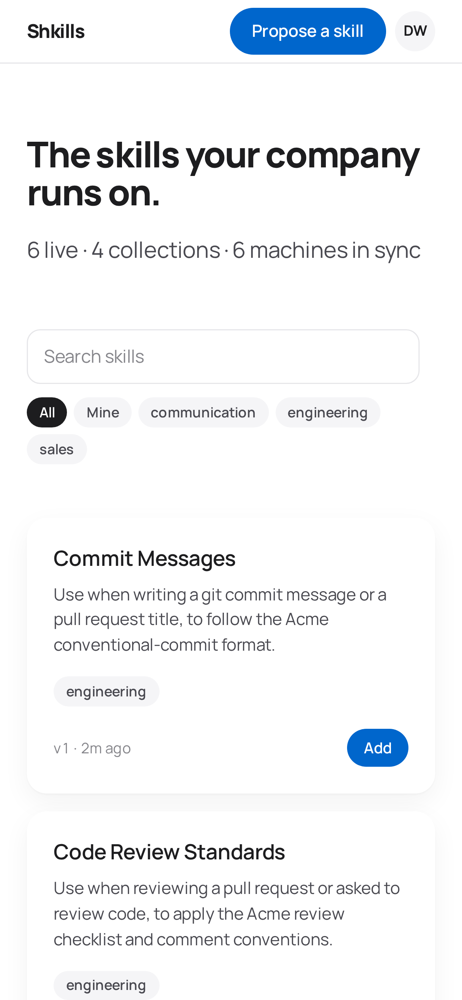
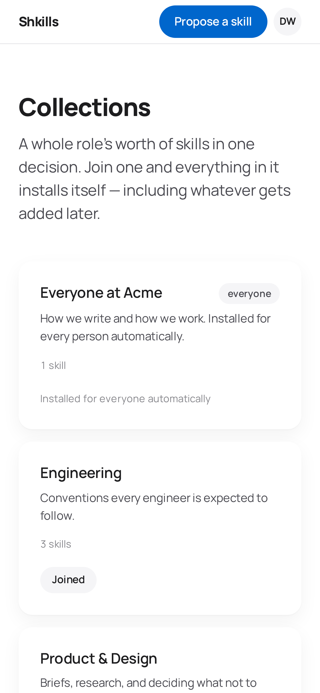

# The portal

A tour of every screen, what it is for, and who can see it.

- [Catalog](#catalog) · [Skill detail](#skill-detail) · [Editor](#editor)
- [Review](#review) · [Collections](#collections) · [People](#people)
- [Your setup](#your-setup) · [Linking a machine](#linking-a-machine)
- [On a phone](#on-a-phone)

---

## Catalog

The front page. Everything published, searchable, with filter chips for
category, audience, *Mine*, and *Only mine to see*.

  

📄 <a href="images/catalog-full.png">See the whole page</a>

The subheading — *"6 live · 4 collections · 6 machines in sync"* — is the number
that tells you whether this is working. "Machines in sync" counts distinct people
whose CLI has checked in within the last day.

**Add** subscribes you directly to one skill. It appears on your machines at the
start of your next Claude session.

Unpublished skills still show in the catalog for curators, falling back to their
most recent version so a proposal never renders as a blank card.

Your own **personal** skills sit here too, marked *"only you can see this"* and
with *"on your machines"* where the Add button would be — they are already
there, without a subscription. Nobody else's personal skills appear, whatever
your role, and the *"N live"* count in the subheading counts company skills
only.

## Skill detail

Three tabs, in order of how often you want them.

  

📄 <a href="images/skill-detail-full.png">See the whole page</a>

| Tab | Shows |
| --- | ----- |
| **The skill** | The instructions, rendered. |
| **What Claude reads** | The exact `SKILL.md` bytes, frontmatter included. No guessing. |
| **History** | Every version, its author, its reviewer, the change note and the review note. Curators can roll back from here. |

The header carries the trigger description, the owner, the version, and which
collections carry this skill.

`Archive` retires a skill: it stops being served to every machine on the next
sync, but the history stays auditable. Owners can archive their own; curators can
archive anyone's; only an admin can purge one permanently.

On a personal skill of your own, the header instead offers **Offer it to
everybody**. The dialog says what actually happens: a curator reads it and
decides, and until they do nothing changes — it is still only yours, and it
stays on your machines whichever way they go. While the request waits you can
**Withdraw** it; if it is declined, the reason is shown on the page and the
skill is simply still yours.

## Editor

Where a skill is written or revised.

  

📄 <a href="images/editor-full.png">See the whole editor</a>

The layout is deliberate. **"When should Claude use this?"** gets the most
prominent treatment on the page, because that one sentence decides whether the
skill ever fires. The server enforces a 20-character minimum on it with the error
*"a description is what makes Claude pick the skill — write at least a
sentence."*

- **Name** is the directory Claude reads from, and is fixed once created.
- **Preview** renders the Markdown as Claude will see it.
- **Let people run it by name** adds a `/<slug>` command as well as automatic
  triggering.
- The sidebar carries a short checklist of what makes a skill work.

Members land in the review queue. Curators publish directly, with an explicit
*"send for review instead"* when they want a second pair of eyes.

**Who is this for?** is the first choice on a new skill, because it changes what
the rest of the page means. *The company* is the default and behaves as above.
*Just me, for now* skips review entirely, syncs to your own machines, and stays
invisible to everyone else — the button then reads **Save to my machines**. It
is only offered when writing a new skill; changing an existing skill's audience
is what the share request on its detail page is for.

## Review

The curator's queue. Oldest first.

  

📄 <a href="images/review-full.png">See the whole queue</a>

Each card shows what changed, why (the author's change note), and the trigger
description, with the full instructions one click away. **Approve** publishes it
to every subscribed machine; **Decline** requires a reason, which the author
sees.

The queue holds two kinds of thing. **Proposals** are versions waiting to be
published. **Offers to share** are personal skills whose owner would like
everybody to have them — those cards say *"wants to share"*, and the card is
explicit that declining leaves the skill exactly where it is, on its owner's
machines and nobody else's. The nav badge counts both, so nobody has to remember
to look.

Approving does not require the author to do anything else. The version becomes
`approved`, the previously live one becomes `superseded`, and the next sync on
every subscribed machine picks it up.

*Visible to curators and admins.*

## Collections

Sets of skills people join in one decision.

  

  

**Join** subscribes you to everything in the set — including whatever gets added
later. A collection marked **company default** shows as *"Installed for everyone
automatically"* and has no leave button, because there is no leaving it.

Curators create collections and manage their contents. Adding a skill to a
collection installs it for every member of that collection on their next sync,
which makes this the fastest way to roll something out to a whole department.

## People

Adoption at a glance, and role management.

  

The four numbers across the top — people, machines linked, synced today, waiting
on review — are the health check. Every row shows how many machines that person
has linked and when they last synced, which is how you find the colleague who
installed the CLI in March and has not opened Claude since.

The role dropdown is admin-only. Shkills refuses to demote or deactivate the last
remaining admin.

*Visible to curators (read-only) and admins (editable).*

## Your setup

The page you send to a new colleague.

  

📄 <a href="images/setup-full.png">See the whole page</a>

One command, a copy button, and an honest "there is no step three". Below the
fold:

- **What you get today** — every skill currently reaching your machines, with the
  collection or direct subscription that put it there.
- **Your machines** — everything you have linked, when it last synced, and a
  **Revoke** button for each. This is what you use when a laptop is lost or a CI
  token leaks; revoking takes effect on the next request.
- **Useful commands** — the six CLI commands worth knowing.

## Linking a machine

Where the code the CLI printed gets approved.

  

It names the machine before you commit, so approving a code somebody read to you
over a call is a decision rather than a reflex. **No, that wasn't me** marks the
request denied immediately.

The CLI links you straight here with the code pre-filled; typing it by hand at
`/link` works too.

## On a phone

The portal is responsive throughout — reviewing a proposal from a phone works.

  
  &nbsp;&nbsp;
  

