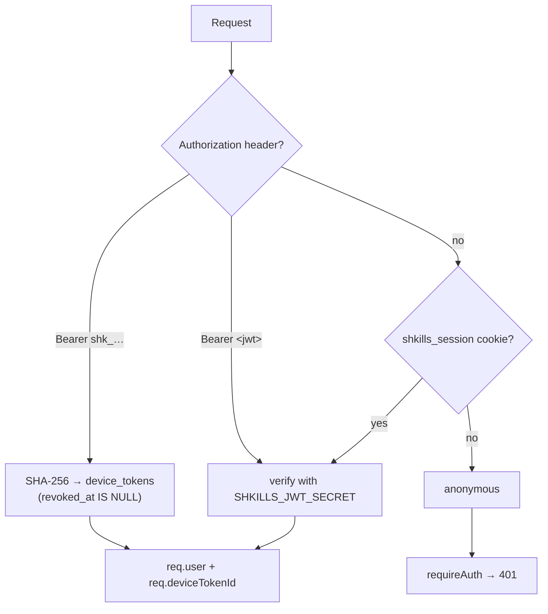

# Security

What Shkills protects, how, and what it deliberately does not try to do.

- [The short version](#the-short-version)
- [Authentication](#authentication) · [Authorisation](#authorisation)
- [Device tokens](#device-tokens) · [Sessions](#sessions) · [Passwords](#passwords)
- [Recovering a lost password](#recovering-a-lost-password)
- [What lands on a laptop](#what-lands-on-a-laptop)
- [Audit trail](#audit-trail)
- [Threat model](#threat-model)
- [Hardening checklist](#hardening-checklist)
- [Reporting a vulnerability](#reporting-a-vulnerability)

---

## The short version

- Passwords are **bcrypt** hashes (cost 10). Never stored or logged in the clear.
- Sessions are **`httpOnly` JWT cookies**, `sameSite=lax`, `Secure` when the
  public URL is https, 12-hour lifetime — and can all be ended at once.
- CLI credentials are **bearer tokens stored only as SHA-256 hashes**, one per
  machine, individually revocable.
- CLI login uses the **device-authorization flow** — the CLI never sees a
  password.
- Every state-changing action is written to an **append-only audit log**.
- Input is validated with **zod** at the edge; every query is a **prepared
  statement**.
- The sync engine **never touches a file it did not create**.
- A lost password is recovered with a **single-use link that expires in an
  hour**, stored only as a hash, and asking for one **reveals nothing** about
  whether the address belongs to anybody.

## Authentication

Two credentials, resolved by one middleware.



The middleware never rejects on its own — it populates `req.user` or leaves it
undefined, and `requireAuth` / `requireRole` decide. That keeps the "who are
you" question in one place and the "are you allowed" question at each route.

Both an inactive account (`active = 0`) and a revoked token resolve to nobody, so
deactivating a person stops every one of their machines at once.

## Authorisation

Three roles, ranked. `requireRole('curator')` accepts curators and admins.

| | member | curator | admin |
| --- | :---: | :---: | :---: |
| Browse, subscribe, sync | ✓ | ✓ | ✓ |
| Propose skills and revisions | ✓ | ✓ | ✓ |
| Archive **their own** skill | ✓ | ✓ | ✓ |
| Approve, reject, roll back | | ✓ | ✓ |
| Publish without review | | ✓ | ✓ |
| Create and manage collections | | ✓ | ✓ |
| Archive or restore **any** skill | | ✓ | ✓ |
| Read the audit log and the people list | | ✓ | ✓ |
| Create accounts, change roles, deactivate | | | ✓ |
| Purge a skill permanently | | | ✓ |

Two safety rails:

- **The last active admin cannot be demoted or deactivated** — `409`. Locking
  yourself out would brick the deployment.
- **Purge is admin-only and separate from archive.** Taking a skill off every
  machine permanently is a different decision from retiring it.

## Device tokens

```
shk_<8 hex chars>_<32 url-safe chars>
```

- The prefix is stored in the clear so the UI can identify a token without
  holding it; the whole token is stored **only as a SHA-256 hash**, with a
  `UNIQUE` index on that column.
- The plaintext exists in `device_auth.token` for **exactly one pickup**, then the
  column is nulled and the row marked `claimed`. A second attempt gets `409`.
- Tokens **do not expire**, by design — a laptop that syncs once a quarter should
  still work. They are revoked explicitly instead.
- Revocation is immediate: the lookup filters on `revoked_at IS NULL`, so the
  very next request fails.
- Every use stamps `last_used_at`; every sync stamps `last_sync_at`. Both are
  visible to the owner in *Your setup* and to curators on **People**.

The login codes themselves:

- 8 characters from `BCDFGHJKLMNPQRSTVWXZ23456789` — no vowels (so no accidental
  words) and no look-alike glyphs.
- Generated with `crypto.randomInt`, not `Math.random`.
- **15-minute** lifetime; expired rows are swept whenever a new code is issued.
- Approval requires a signed-in browser session, and the approval screen names
  the machine first — the phishing case is "someone reads you a code over the
  phone", and seeing `is this you on build-runner-07?` is what stops it.
- **Deny** is a first-class action, not just letting it expire.

`POST /api/v1/device/code` is necessarily unauthenticated. It is cheap, and a
code is worthless without a signed-in human approving it.

## Sessions

| Property | Value | Why |
| -------- | ----- | --- |
| Cookie | `shkills_session` | |
| `httpOnly` | yes | Script cannot read it |
| `sameSite` | `lax` | Blocks cross-site POST; keeps the device-link URL working when opened from a terminal |
| `secure` | when `SHKILLS_PUBLIC_URL` is https | A `Secure` cookie over plain http is silently dropped by the browser |
| Lifetime | 12 hours | Both the cookie `maxAge` and the JWT `exp` |
| Signature | HS256 with `SHKILLS_JWT_SECRET` | |

The token carries `sub` — the user id — and `se`, the account's session epoch.
Role and status are re-read from the database on every request, so a demotion or
deactivation takes effect immediately rather than at the next login.

**Ending every session at once.** Sessions are stateless, so there is nothing to
delete. Instead each account has a counter, and a token is only accepted for the
counter it was signed under; bumping it invalidates every token everywhere in
one statement. A password reset and a password change both bump it (and both
hand the browser doing it a freshly signed one, so you are not signed out of the
page you did it on). A counter rather than a timestamp because `iat` has
one-second resolution and a reset signs a new token in the same second it
invalidates the old.

Rotating `SHKILLS_JWT_SECRET` signs everybody out of the browser and leaves CLI
syncing untouched.

## Passwords

- **bcrypt**, cost factor 10, via `bcryptjs`.
- Minimum 8 characters, enforced at registration, admin creation and change.
- Changing your own password requires the current one.
- **Login reveals nothing.** A wrong email and a wrong password return the
  identical `incorrect email or password`, and an inactive account is
  indistinguishable from a nonexistent one.

## Recovering a lost password

Everything hangs off one artefact: a **single-use link that expires in an hour**.
Only its SHA-256 is stored, so the database never holds a usable one. Minting a
new link retires that account's outstanding ones, and so does setting the
password by any route — a link that survived would be a spare key to an account
somebody has just taken back.

Three ways it reaches its owner, and a deployment uses whichever it can:

| Route | When | Who has to be available |
| ----- | ---- | ----------------------- |
| Emailed | `SHKILLS_SMTP_URL` is set | The mail server |
| Handed over by an administrator | otherwise | Another admin account |
| `npm run reset-password` in the container | always | Somebody with a shell |

The third exists because the second cannot help the administrator of a
deployment whose only account is theirs — which is the normal shape of a
single-tenant install, and exactly the person who most needs a way back in.

**Asking reveals nothing.** `POST /api/v1/auth/forgot` answers `202` with an
identical body whether or not the address belongs to an account, and writes no
record for an address that does not. Otherwise a signed-out stranger could ask
the portal who works here, one address at a time. Repeating the request inside a
minute quietly does nothing, so it cannot be used to flood an inbox or the
administrators' queue.

**What a reset takes back, and what it does not.**

- Every browser session, everywhere, is ended (see [Sessions](#sessions) above).
- **Device tokens are left alone.** They are separate credentials that were never
  derived from the password — the same reasoning that keeps a GitHub personal
  access token alive across a password reset — and revoking them would silently
  stop skills reaching every machine that person owns, which is the one thing
  Shkills promises, for a reason that is usually just forgetfulness. The reset
  instead says how many machines are linked and points at **Your setup**, where
  revoking one is already a single click. If you are resetting because you think
  somebody else got in, that is the page to look at next.

**What is on the record.** `auth.reset_requested` (who was asked about),
`auth.reset_issued` (which administrator handed a link over) and
`auth.password_reset` all land in the audit log, visible to curators and admins.

## What lands on a laptop

Shkills writes files into a developer's home directory, so the blast radius
deserves stating plainly.

**It writes exactly:**

- `~/.shkills/config.json` (mode `0600` — it holds a bearer token) and
  `state.json`
- `~/.shkills/bin/shkills` and `shkills.mjs`
- One `SessionStart` entry in `~/.claude/settings.json`, with a
  `settings.json.shkills-backup` copy taken before any write
- `~/.claude/skills/<slug>/SKILL.md` and `.shkills.json`, **only for directories
  it created**

**It never:**

- modifies or deletes a skill directory without a `.shkills.json` marker —
  a collision is skipped with a warning
- writes anywhere else, at any time
- executes anything it downloads other than the CLI bundle you installed

**The content itself is instructions for Claude.** A malicious approved skill is
a real risk — the same risk as a malicious pull request to a shared config repo,
and mitigated the same way: review before approval, a role that gates it, and an
audit log naming who approved what. This is the reason curators exist and the
reason **company default** collections deserve a higher bar than anything else in
the system.

If `~/.claude/settings.json` is not valid JSON, `shkills setup` refuses to write
rather than guessing.

## Audit trail

`audit_log` is append-only. There is no API to modify or delete an entry.

Every row: who (`actor_id`), what (`action`), on what (`entity`, `entity_id`),
detail, and when. Recorded actions:

| Area | Actions |
| ---- | ------- |
| Auth | `auth.login`, `auth.register`, `auth.password_change` |
| Skills | `skill.propose`, `skill.publish`, `skill.approve`, `skill.reject`, `skill.rollback`, `skill.archive`, `skill.restore`, `skill.delete` |
| Collections | `collection.create`, `collection.update`, `collection.delete`, `collection.add_skill`, `collection.remove_skill` |
| Devices | `device.approve`, `device.revoke` |
| People | `user.create`, `user.update` |

Readable by curators at `GET /api/v1/admin/audit?limit=…` (max 500), newest
first, and indexed on `created_at DESC`.

## Threat model

**Defended**

| Threat | Defence |
| ------ | -------- |
| SQL injection | Every query is a prepared statement with bound parameters. No string interpolation anywhere in a query. |
| Malformed input | zod schemas at every route boundary, with explicit length and format bounds. Bodies capped at 2 MB. |
| Credential stuffing feedback | Identical error for every failed login, and an identical answer to every reset request. |
| Keeping a stolen session after a reset | Every session is ended when a password changes, by bumping the account's session epoch. |
| Token theft from the database | Only SHA-256 hashes are stored. |
| Session theft via XSS | `httpOnly` cookies. |
| Cross-site request forgery | `sameSite=lax` cookies; every mutation is a non-GET request. |
| Privilege escalation | Role checked per route, re-read from the database per request. |
| Losing a laptop | Revoke that one device; nothing else changes. |
| Locking everyone out | The last active admin cannot be demoted or deactivated. |
| Overwriting a colleague's own skill | Marker-file ownership, checked on every write and every delete. |
| A bad skill reaching everyone | Approval workflow, role gate, audit log, and rollback. |

**Not defended — know these**

| Gap | Reality |
| --- | ------- |
| **No rate limiting** | Login and device-code endpoints are unthrottled. Put a rate limit at your proxy if the portal is internet-facing. |
| **No SSO / MFA** | Email and password only. Front it with your identity provider if you need more. |
| **A reset link in transit** | Whoever holds the link holds the account until it is used. Over plain HTTP that includes anyone on the network path — one more reason to put this behind TLS. |
| **Reset requests are unthrottled per sender** | One request per account per minute is enforced; nothing limits how many *different* accounts one sender may ask about. |
| **No CSP or security headers** | Add them at the proxy. `x-powered-by` is disabled; nothing else is set. |
| **Tokens do not expire** | Revocation is manual and explicit. |
| **Skills are visible to everyone signed in** | Audiences are for finding things, not access control. Do not put secrets in a skill. |
| **No encryption at rest** | The SQLite file is plain. Encrypt the volume if that matters. |
| **A compromised curator account** | Can publish anything to every machine. Keep the curator list short and watch the audit log. |

## Hardening checklist

- [ ] TLS in front, always. Device tokens are bearer tokens.
- [ ] `NODE_ENV=production`, so session cookies are `Secure`.
- [ ] `SHKILLS_JWT_SECRET` set explicitly, from your secret store, 48+ random bytes.
- [ ] `SHKILLS_PUBLIC_URL` matches the real address exactly.
- [ ] Rate limit `/api/v1/auth/login` and `/api/v1/device/code` at the proxy.
- [ ] Add security headers (HSTS, CSP, `X-Content-Type-Options`) at the proxy.
- [ ] Create the first admin account **before** sharing the URL — the first
      account created wins.
- [ ] Keep the curator list small and reviewed.
- [ ] Hold **company default** collections to a higher bar than anything else.
- [ ] Back up the database *and* the JWT secret.
- [ ] Check the audit log and the People page periodically.
- [ ] Restrict network access to the VPN if nobody needs it from outside.

## Reporting a vulnerability

Please report privately rather than opening a public issue — see
[SECURITY.md](../SECURITY.md).
