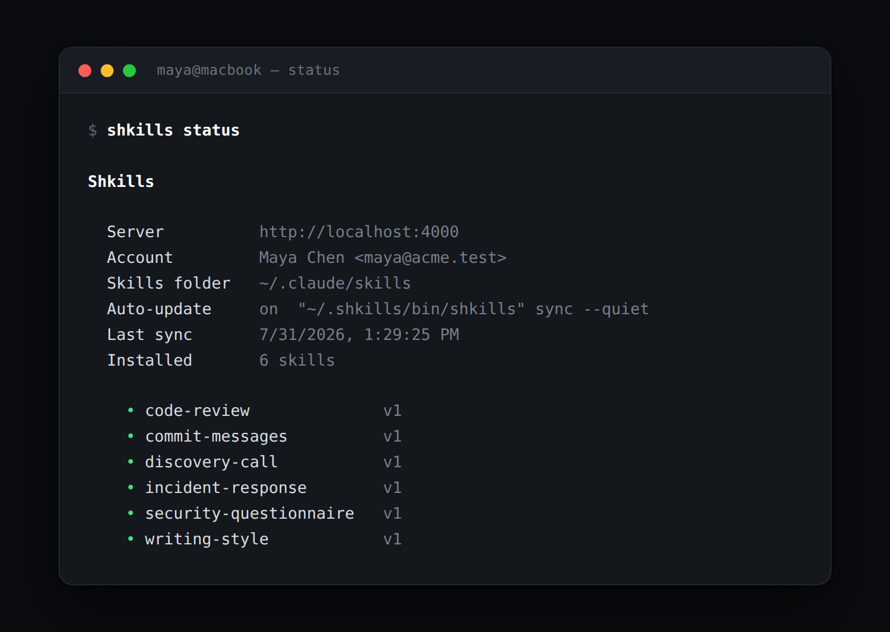

# Troubleshooting

Start with `shkills status`. It answers most of these on its own.

<p align="center">
  
</p>

- [On a machine](#on-a-machine) · [In the portal](#in-the-portal)
- [Running the server](#running-the-server) · [FAQ](#faq)

---

## On a machine

### A published skill has not appeared

Work down this list:

```bash
shkills status          # linked? hook on? when did it last sync?
shkills list            # is the skill in your effective set at all?
shkills sync --force    # bypass the cached manifest
```

The usual causes, in order of frequency:

1. **You are not subscribed to it.** It exists, but nothing puts it in your set.
   `shkills add <name>`, or join the collection that carries it.
2. **It is still pending.** Check the skill in the portal — if there is no
   published version, there is nothing to sync. A curator has to approve it.
3. **The session started before it was approved.** The hook runs at session
   start. Run `shkills sync`, or start a new session.
4. **Auto-update is off.** `shkills status` shows
   `off — run 'shkills setup'`. Run `shkills setup`.
5. **A name collision.** See the next item.

### `skipped <name> — a skill of your own already uses that name`

You have a hand-written `~/.claude/skills/<name>/` with no `.shkills.json`
marker, and Shkills will not overwrite it. That is the intended behaviour.

To hand the name over:

```bash
mv ~/.claude/skills/<name> ~/.claude/skills/<name>.mine
shkills sync --force
```

To keep yours instead, ask a curator to rename the company skill — or just
unsubscribe from it.

### `not linked — run 'shkills login'` / `your Shkills login expired`

The device token is missing or revoked. Re-link:

```bash
shkills login
```

If somebody revoked it from *Your setup*, that was deliberate — check with them
before relinking.

### Auto-update shows `off` after it was on

`shkills setup` matches its own hook entry by pattern. It goes missing if:

- somebody edited `~/.claude/settings.json` and removed it,
- the CLI moved (a manual install path change),
- `shkills setup --off` was run.

`shkills setup` puts it back. It rewrites its own entry rather than appending a
duplicate.

### `~/.claude/settings.json is not valid JSON`

Shkills refuses to write to a settings file it cannot parse, rather than guessing
at your intent. Fix the JSON — `python3 -m json.tool < ~/.claude/settings.json`
will point at the line — and run `shkills setup` again. If a previous run wrote
the file, `~/.claude/settings.json.shkills-backup` is your rollback.

### `shkills: command not found`

The installer adds `~/.shkills/bin` to `PATH` in your shell rc file, which the
*current* shell has not read. Open a new terminal, or:

```bash
export PATH="$HOME/.shkills/bin:$PATH"
```

If your shell is neither zsh nor bash, add that line to its rc file yourself.

### `Node.js 20+ is required`

The CLI bundle is modern ESM. `node -v` to check, then install Node 20 or newer.
Note that Claude spawns the hook with its own environment — if `node` is
installed via a version manager that only initialises for interactive shells,
the hook can fail while your terminal works. Point the manager's shim at a
default version, or install Node system-wide.

### A skill is on disk but Claude does not use it

Shkills has done its job — the file is there and correct (`shkills show <name>`
proves it). What is left is the skill itself: Claude picks a skill from its
**description**, and a vague description does not fire. See
[Writing skills](authoring-skills.md#the-description-is-the-whole-game).

### I want it all gone

```bash
shkills setup --off   # stop the automatic updates
shkills clean         # remove every skill Shkills installed — and nothing else
shkills logout        # unlink this machine
rm -rf ~/.shkills     # remove the CLI itself
```

Then delete the `PATH` line from your shell rc file. Your own skills are
untouched throughout.

---

## In the portal

### I cannot see Review or People

Those pages are for curators and admins. Ask an admin to change your role on the
**People** page.

### I cannot leave a collection

It is marked **company default**. Those apply to everybody by design and the API
returns `409` — *"company default collections cannot be unsubscribed"*. If it
should not be a default, a curator can change that in the collection's settings.

### `a description is what makes Claude pick the skill — write at least a sentence`

The description is under 20 characters. This is the field Claude uses to decide
whether to reach for the skill at all, so it is validated harder than the rest.

### `a skill named "…" already exists`

Slugs are globally unique. Pick another, or propose a revision to the existing
skill instead — that is usually what you actually want.

### `version is approved, only pending versions can be approved`

Somebody else got there first, or you are looking at a stale page. Reload the
review queue.

### I approved the wrong thing

Open the skill, go to **History**, and roll back to the previous version. Every
machine returns to it on the next sync. The rollback is recorded in the audit
log; nothing is lost.

### I am locked out — no admin account

If the account was deactivated: it cannot have been the last one, since Shkills
refuses that. Another admin can reactivate it.

If the deployment genuinely has no admin, promote one directly:

```bash
sqlite3 /data/shkills.sqlite \
  "UPDATE users SET role='admin', active=1 WHERE email='you@yourcompany.com';"
```

---

## Running the server

### Everyone was signed out after a deploy

`SHKILLS_JWT_SECRET` changed. Set it explicitly and keep it stable —
see [Deployment](deployment.md#about-shkills_jwt_secret). CLI syncing is
unaffected by this, since device tokens are not JWTs.

### The install command shows the wrong URL

The portal, `/install.sh` and the device-link URL all name back the address the
request came in on, so the usual answer is that the address you reached really
is the one being echoed. Check in this order:

1. **A proxy is rewriting the Host header.** Whatever it forwards is what gets
   named back. Confirm with `curl -sS <your-url>/install.sh | grep SHKILLS_HOST`.
2. **TLS terminates at a proxy and the URLs come out `http://`.** Set
   `SHKILLS_TRUST_PROXY=true` so `X-Forwarded-Proto` is honoured.
3. **You reached it by an address you did not mean to hand out** — a pod IP, a
   NodePort. Either use the address you want people to use, or set
   `SHKILLS_PIN_PUBLIC_URL=true` so everyone gets `SHKILLS_PUBLIC_URL` instead.
4. **The Host header is not a plain `host[:port]`**, in which case it is refused
   on purpose and `SHKILLS_PUBLIC_URL` is used — so check that one is right too.

### A machine is still syncing from the old address

It keeps whatever it was installed with. Move it without unlinking it:

```bash
shkills set-host https://shkills.yourcompany.com
shkills status                       # confirms where it is talking to
```

Re-running the installer does the same thing, which is what makes it safe to
put in a laptop setup script.

### The Copy button does nothing

Fixed — but if it comes back, the cause is almost certainly the same:
`navigator.clipboard` exists **only in a secure context** (https, or
localhost), so on a plain-HTTP deployment it is `undefined`. The portal falls
back to `document.execCommand('copy')`, and if a browser refuses both the
button says "Copy it yourself" rather than looking like it worked. Select the
command and copy it by hand; nothing else is broken.

### `CLI bundle not built — run 'npm run build'`

`/cli/shkills.mjs` returns `503` because `packages/cli/dist/shkills.mjs` is
missing. Run `npm run build`; in Docker, rebuild the image.

### Every sync is a full download instead of a 304

Something between the CLI and the server is stripping `If-None-Match` or `ETag`.
Check your reverse proxy. Confirm with:

```bash
curl -sI -H "Authorization: Bearer $SHKILLS_TOKEN" \
  https://shkills.yourcompany.com/api/v1/sync | grep -i etag
```

then repeat with `-H 'If-None-Match: "<that value>"'` and expect `304`.

### `database is locked`

Rare in WAL mode. Usually a second writer — a stray `npm start` alongside the
container, or a `sqlite3` session with an open write transaction. Only one
process should have the file open for writing.

### The portal 404s but the API works

The server serves the built SPA from `packages/web/dist` or `../public`, relative
to its own output. If neither exists it serves the API only. Run `npm run build`
and keep the workspace layout intact.

---

## FAQ

**Does this replace my own skills?**
No. Shkills only writes directories it created, each with a `.shkills.json`
marker. A name collision is skipped with a warning. Delete the marker and the
directory is yours permanently.

**How fast does a change propagate?**
By the start of each person's next Claude session. There is no polling interval
to tune — the `SessionStart` hook runs at the only moment that matters.

**What if the server is down?**
Claude starts normally with whatever is already on disk, and the CLI prints a
warning. Sync always exits `0`.

**Can I use Shkills without the hook?**
Yes — `shkills setup --off` and run `shkills sync` when you want. You lose the
guarantee that every session is current, which is the whole point, but nothing
breaks.

**Does it work with `CLAUDE_CONFIG_DIR`?**
Yes. The CLI honours it exactly as Claude Code does.

**Can two people own the same skill name?**
No. Slugs are globally unique — they are directory names.

**What happens to skills when someone leaves?**
Deactivate the account: every session and every device stops immediately. The
skills they wrote stay published; reassigning ownership means editing
`skills.owner_id` directly.

**Are skills private to their audience?**
No. Audiences are for *finding* things, not access control — everyone signed in
can read every skill. Do not put secrets in a skill.

**Can I put binaries or extra files in a skill?**
Not today. A skill is one `SKILL.md`.

**Can I import the skills I already have?**
Paste them into the editor. There is no bulk importer yet — the API makes one
straightforward to script against `POST /api/v1/skills`.

**How do I roll something out to everyone at once?**
Put it in a collection marked **company default**. That is exactly what defaults
are for, and exactly why they deserve a higher review bar.
